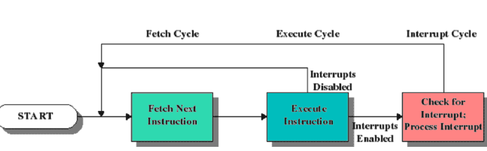
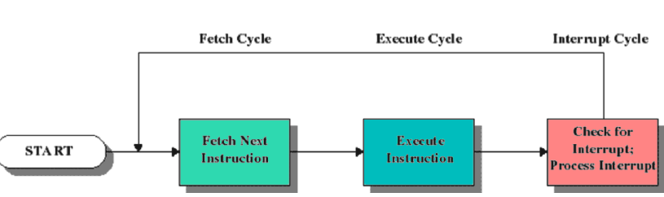

# Overzicht Besturingssystemen

## Basisbegrippen computerarchitectuur

### Instructiecyclus

### Kernelmodus en gebruikersmodus

### Input/Output

### Interrupts

### Geheugenhiërarchie

## Doel en functie

## Kenmerken van moderne besturingssystemen

### Multitasking en multithreading

### Symmetrische multiprocessing

### Modulair ontwerp

#### Microkernelarchitectuur

#### Objectgeomriënteerd ontwerp

#### Gedistribueerde omgeving

## Overzicht Windows NT & Unix/Linux

Andere foto's op slides

# Functie van besturingssystemen

## Virtuele machine: meer eenvoudige, gelaagde interface naar gebruikers en programmeurs toe

## Beheerder van bronnen

### Processor(en)
### Geheugens
### I/O-apparaten

## Eenvoudige interface

### Laden en uitvoeren van programma's
### Toegang tot hulpprogramma's
### Afhandeling software en hardware fouten
### Uniforme interface naar I/O-apparaten
### Uniforme toegang tot bestanden
### Samenwerking en synchronisatie programma's
### Beveiliging
### Gebruik- en prestatiestatistieken

## Beheerder van bronnen: toewijzen van voorzieningen aan programma's

### Processor(en)
### Geheugens
### I/O-apparaten en bestanden

#### Regeling van de gegevensstroom

# Kenmerken van moderne besturingssystemen

* Multitasking en multithreading
* Symmetrische multiprocessing
* Modulair ontwerp 
    * Microkernelarchitectuur
       * Kernel kan niet verwijderd worden, heeft een vaste positie
    * Objectgeoriënteerd ontwerp
    * Gedistribueerde omgeving

* Foto's op slides te zien
