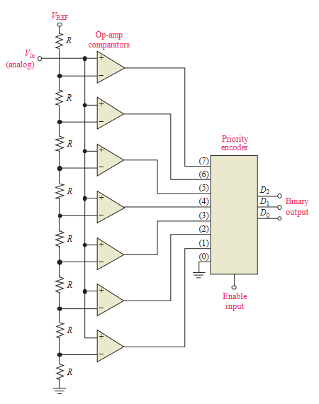

# 13 - Basic Op-Amp Circuits

## 1 Comparators

### Zero-Level Detection

* Inverterende ingang (-) aan de grond
* Niet-inverterende ingang (+) aan het ingangssignaal
* Klein verschil tussen de twee ingangen stuurt Op-Amp in saturatie
    * Door hoge open-loop spanningsversterking

### Non-Zero Level Detection

* Een vaste referentie spanningsbron aan de inverterende ingang (-)
    * Kan met behulp van:
        * Een spanningsdeler
        * Een Zenerdiode
* Het ingangssignaal aan de niet-inverterende ingang (+)

### Input Noise on Comparator Operation

#### Reducing Noise Effects with Hysteris

* Vorm van positieve feedback
* Hogere referentie wanneer de ingangsspanning van een lagere naar hogere waarde gaat

$$ V_{LTP} = {R_2 \over R_1 + R_2}(-V_{out(max)}) $$
$$ V_{UTP} = {R_2 \over R_1 + R_2}(-V_{out(max)}) $$

### Comparator Applications

#### Analog-to-Digital (A/D) Conversion

## 2 Summing Amplifiers

### Summing Amplifiers with Unity Gain

* Twee of meer ingangen
* Uitgangsspanning proportioneel ten op zichte van de negatieve waarde van de algebraïsche som van de ingangsspanningen
* 0 V aan de inverterende ingang (-), stroom loopt via de $R_f$

## 3 Integrators and Differentiators

### The Op-Amp Integrator

#### The Ideal Op-Amp Integrator

* Condensator die de inverterende ingang (-) met de uitgang verbindt
* 0 V aan de inverterende ingang (-)

#### The Practical Op-Amp Integrator

* Condensator en weerstand in parallel die de inverterende ingang (-) met de uitgang verbinden
* 0 V aan de inverterende ingang (-)

### The Op-Amp Differentiator

#### The Ideal Op-Amp Differentiator

* Condensator voor de inverterende ingang (-)
* Weerstand die na de condensator en voor de inverterende ingang (-) verbindt met de uitgang
* 0 V aan de inverterende ingang (-)

#### The Practical Op-Amp Differentiator

* Zelfde van de ideale, maar nog een weerstand extra voor de condensator