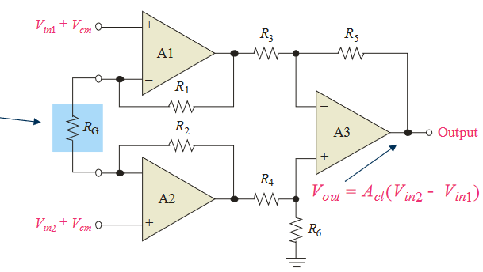

# 14 - Special-Purpose Integrated Circuits

## 1 Instrumentational Amplifiers

* Differentieel spanningstoename toestel
* Versterkt het verschil tussen de twee ingangsspanningen
* Sleuteleigenschappen:
    * Hoge ingangsimpedantie
    * Hoge common-mode rejection
    * Lage uitgangsoffset
    * Lage uitgangsimpedantie

* Basiscircuit:
    * 3 Operational Amplifiers
    * Meerdere weerstanden
    * Spanningsversterking: externe weerstand
    * Op-Amp $A_1$ en $A_2$ zijn noninverting configuraties die een hoge ingangsimpedantie & spanningsversterking bieden
    * Op-Amp $A_3$ is een unity-gain differentiële versterker met hoge precisie weerstanden die allen gelijke waardes hebben

### Noise Effects in Instrumentation Amplifier Applications

#### Shield Guard

* Techniek om de effecten van ruis te onderdrukken
* Elimineren van spanningsverschillen tussen de signalen en het schild
* Elimineren lekstromen