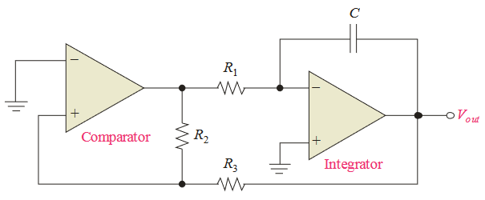
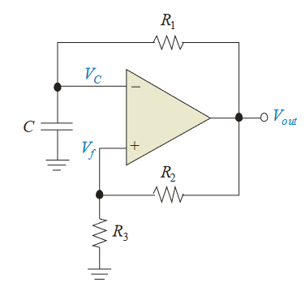
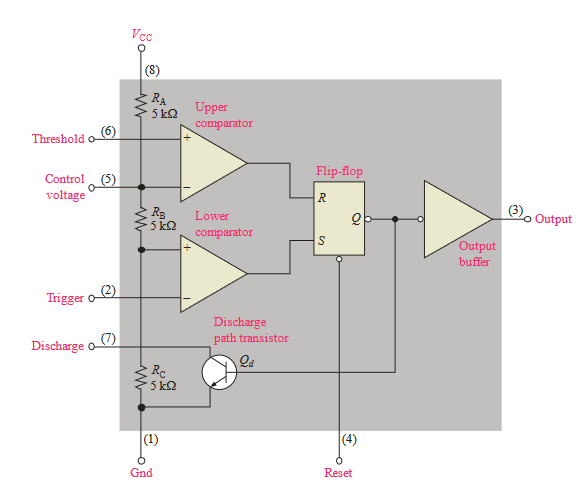

# 16 - Oscillators

## 5 Relaxation Oscillators

### A Triangular-Wave Oscillator

#### A Practical Triangular-Wave Oscillator

* Op-Amp comparator met hysteresis
* $V_{out}$ = $V_{LTP}$
    * +$V_{max}$ wordt -$V_{max}$
* $V_{out}$ = $V_{UTP}$
    * -$V_{max}$ wordt +$V_{max}$

### A Square-Wave Oscillator

* Gebaseerd op het op- en ontladen van de condensator

## 6 The 555 Timer as an Oscillator

* Bestaat uit:
    * 2 Comparators
    * 1 Flip-flop
    * 1 Ontladingstransistor
    * 1 Weerstandsspanningdeler

### Astable Operation

* Een vrijlopende relaxatie oscillator
* Thresholdingang is verbonden met de triggeringang
* $C_{ext}$ begint op te laden door $R_1$ en $R_2$
* Als de condensator 1/3de van de waarde van de voedingsspanning bereikt, dan bereikt de onderste comparator zijn lage-ingang status
* Als de condensator 2/3de van de waarde van de voedingsspanning bereikt, dan bereikt de bovenste comparator zijn hoge-ingang status
* Hierdoor wordt de Flip-flop gereset, waardoor de transistor wordt ingeschakeld
* Dit zal de condensator doen ontladen, eens de waarde van 1/3 van de voedingsspanning bereikt wordt, zal de Flip-flop geset worden
* Hierdoor slaat de transistor uit, waardoor het proces zich herhaalt

