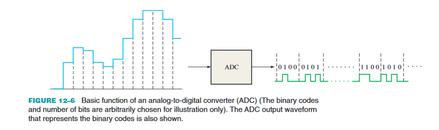
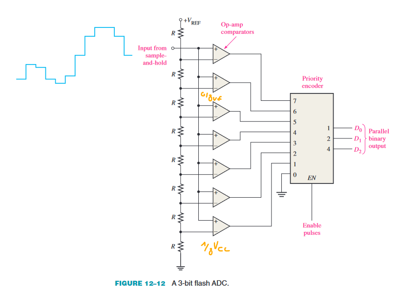
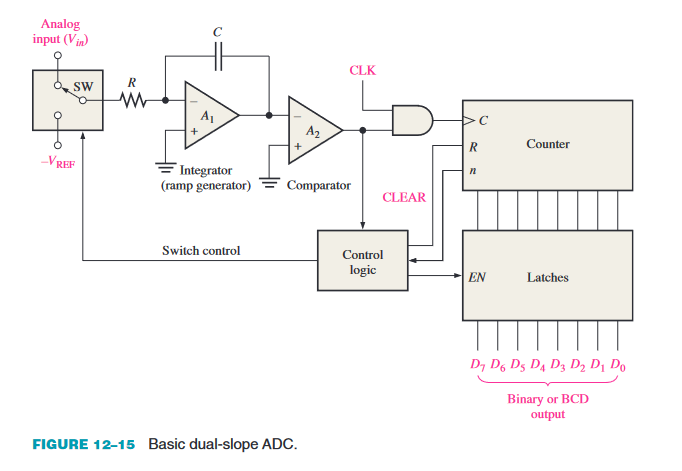
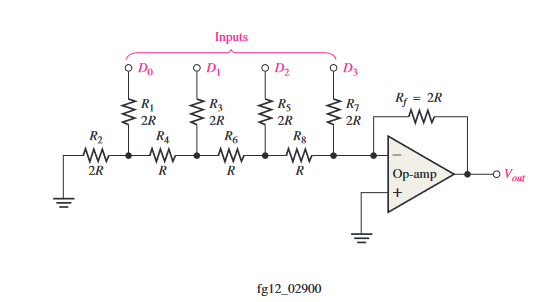

# 12 Signal Conversion and Processing

## 1 Analog-to-Digital Conversion

### Sampling and Filtering

* Sample
    * Momentopname
    * Waarde van een signaal op een bepaald tijdstip

#### The Sampling Theorem

* Een signaal kan perfect gereconstrueerd worden als het gesampled wordt met een frequentie die minstens 2 keer zo hoog is als de hoogste frequentiecomponent van het signaal

#### The Need for Filtering

* Een laagdoorlaatfilter is nodig om de hogere frequentiecomponenten van het signaal te verwijderen

### Analog-to-Digital Conversion

* Een ADC zet een analoog signaal om naar een digitaal signaal
* Een ADC heeft een analoog ingangssignaal en een digitaal uitgangssignaal
* Een ADC heeft een klok
* Een ADC heeft een aantal bits
    * 8 bits
    * 10 bits
    * 12 bits
    * 16 bits

### Quantization

* Een ADC heeft een aantal bits
* Een ADC heeft een aantal discrete niveaus
* Een ADC heeft een aantal discrete stappen
* Een ADC heeft een aantal discrete waarden

## 2 Methods of Analog-to-Digital Conversion

### A Quick Look at an Operational Amplifier

* Een operationele versterker is een actief component
* Een operationele versterker heeft een aantal ingangen
* Een operationele versterker heeft een aantal uitgangen
* Een operationele versterker heeft een aantal voedingen
* Een operationele versterker heeft een aantal weerstanden
* Een operationele versterker heeft een aantal condensatoren

### Flash (Simultaneous) Analog-to-Digital Conversion

* Een flash ADC heeft een aantal ingangen
* Een flash ADC heeft een aantal uitgangen
* Een flash ADC heeft een aantal weerstanden
* Een flash ADC heeft een aantal comparators
* Een flash ADC heeft een aantal logische poorten

### Dual-Slope Analog-to-Digital Conversion

* Een dual-slope ADC heeft een aantal ingangen
* Een dual-slope ADC heeft een aantal uitgangen
* Een dual-slope ADC heeft een aantal weerstanden
* Een dual-slope ADC heeft een aantal condensatoren
* Een dual-slope ADC heeft een aantal logische poorten

## 3 Methods of Digital-to-Analog Conversion

### Binary-Weighted-Input Digital-to-Analog Conversion

* Een DAC heeft een aantal ingangen
* Een DAC heeft een aantal uitgangen
* Een DAC heeft een aantal weerstanden
* Een DAC heeft een aantal logische poorten

#### The R-2R Ladder Digital-to-Analog Converter

