# 3 - Logic Gates

## 1 The Inverter

* Inversie- of complementatie-methode

### The Negation and Polarity Indicators

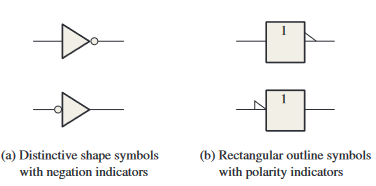

### Inverter Truth Table

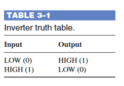

### Inverter Operation

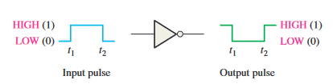

### Logic Expression for an Inverter

* Streepje over de letter
* $ X = \bar{A} $ 

## 2 The AND Gate

* Basispoort
* Twee of meer ingangen
* Logische vermenigvuldiging

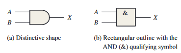

### Operation of an AND Gate

* Produceert een HOGE uitgang, enkel en alleen als alle ingangen HOOG zijn
* Als één van de ingangen LAAG is, zal de uitgang evengoed LAAG zijn

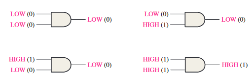

### AND Gate Truth Table

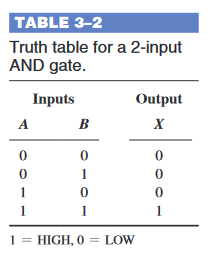

### AND Gate Operation with Waveform Inputs

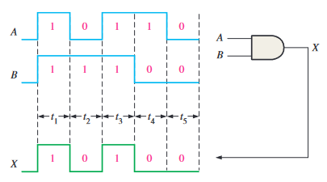

### Logic Expressions for an AND Gate

* $ 0 * 0 = 0 $
* $ 0 * 1 = 0 $
* $ 1 * 0 = 0 $
* $ 1 * 1 = 1 $

* $ X = AB $

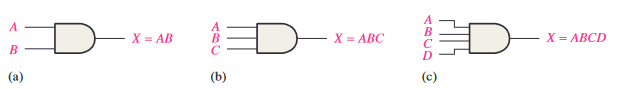

### Applications

#### A Seat Belt Alarm System

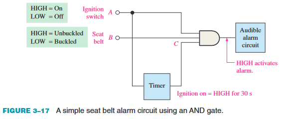

## 3 The OR Gate

* Twee of meer ingangen
* Als een ingang HOOG staat, zal de uitgang ook HOOG staan
* Als alle ingangen LAAG staan, zal de uitgang ook LAAG staan

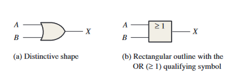

### Operation of an OR Gate

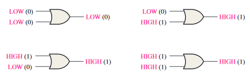

### OR Gate Truth Table

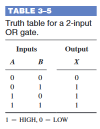

### OR Gate Operation with Waveform Inputs

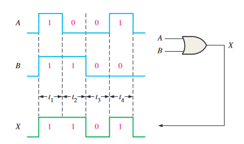

### Logic Expressions for an OR Gate

* $ 0 + 0 = 0 $
* $ 0 + 1 = 1 $
* $ 1 + 0 = 1 $
* $ 1 + 1 = 1 $

* $ X = A + B $

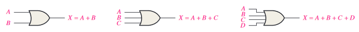

### An Application

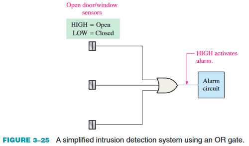

## 4 The NAND Gate

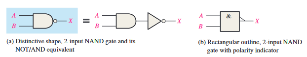

### Operation of a NAND Gate

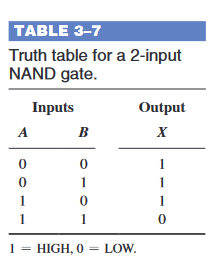

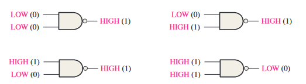

### NAND Gate Operation with Waveform Inputs

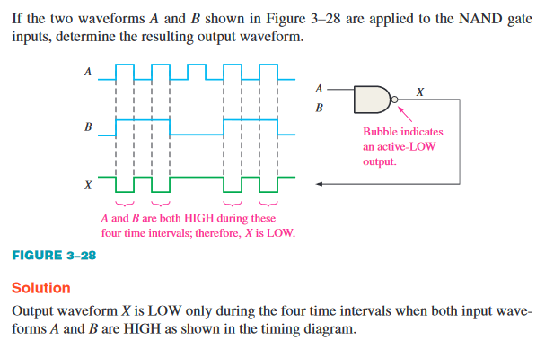

### Negative-OR Equivalent Operation of a NAND Gate

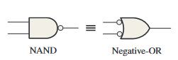

### Logic Expressions for a NAND Gate

* $ X = \bar{AB} $

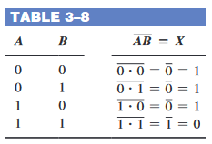

## 5 The NOR Gate

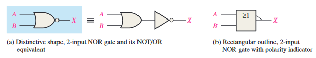

### Operation of a NOR Gate

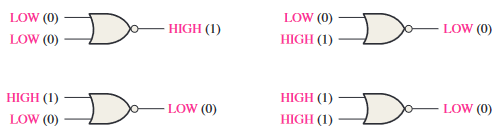

### NOR Gate Operation with Waveform Inputs

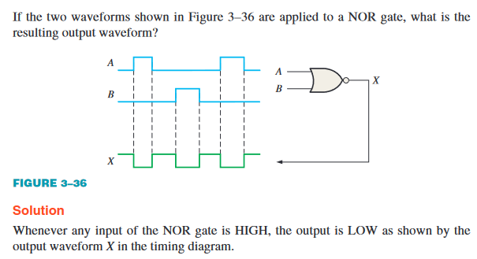

### Negative-AND Equivalent Operation of the NOR Gate

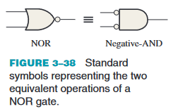

### Logic Expressions for a NOR Gate

* $ X = \bar{A + B} $

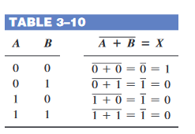

## 6 The Exclusive-OR and Exclusive-NOR Gates

### The Exclusive-OR Gate

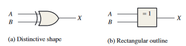

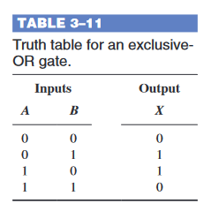

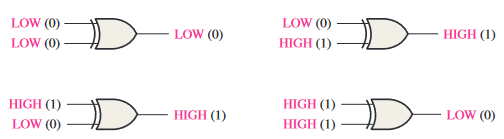

### The Exclusive NOR-Gate

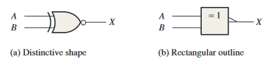

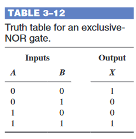

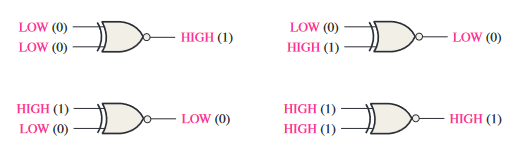