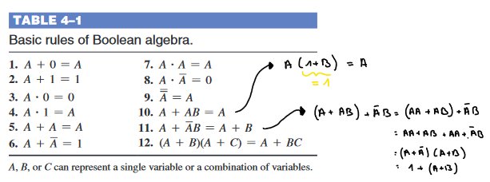
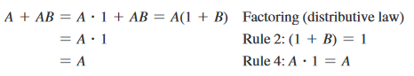
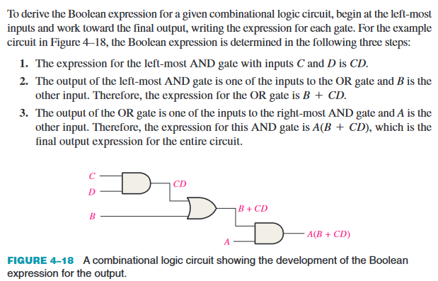
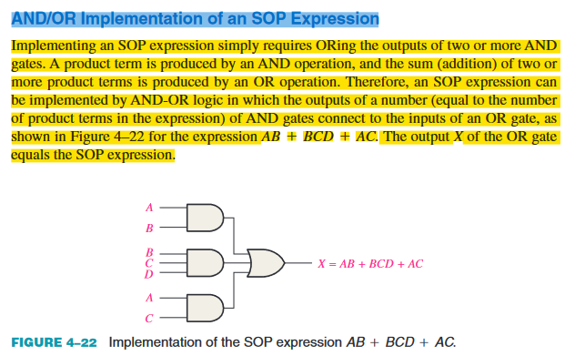
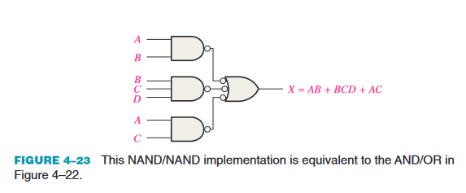
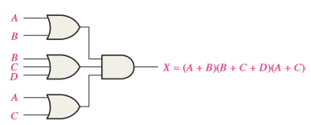
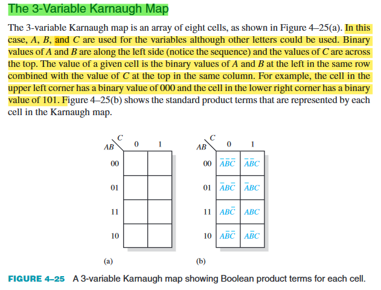
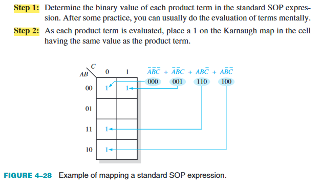

# 4 - Boolean Algebra and Logic Simplification

## 1 Boolean Operations and Expressions

### Boolean Addition

* Optelling van verschillende booleaanse constanten

### Boolean Multiplication

* Vermenigvuldiging van verschillende booleaanse constanten

## 2 Laws and Rules of Boolean Algebra

### Laws of Boolean Algebra

#### Commutative Laws

* $ A + B = B + A $
* $ A * B = B * A $

#### Associative Laws

* $ A + (B + C) = (A + B) + C $
* $ A * (B * C) = (A * B) * C $

#### Distributive Law

* $ A * (B + C) = AB + AC $

### Rules of Boolean Algebra

## 3 DeMorgan's Theorems

* The complement of two or more ANDed variables is equivalent to the OR of the
complements of the individual variables.
* $ \bar{XY} = \bar{X} + \bar{Y} $

## 4 Boolean Analysis of Logic Circuits

## 6 Standard Forms of Boolean Expressions 

### The Sum-of-Products (SOP) Form

### The Product-of-Sums (POS) Expression

## 8 The Karnaugh Map

## 9 Karnaugh Map SOP Minimization

