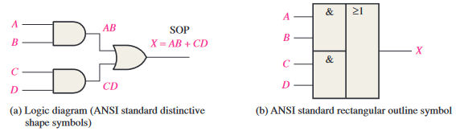
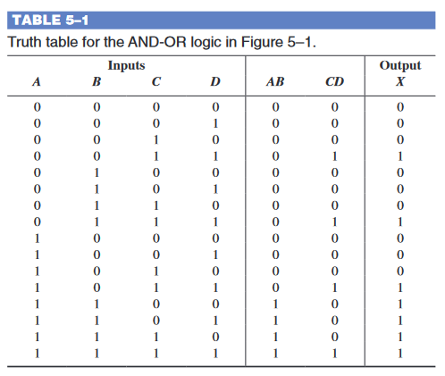
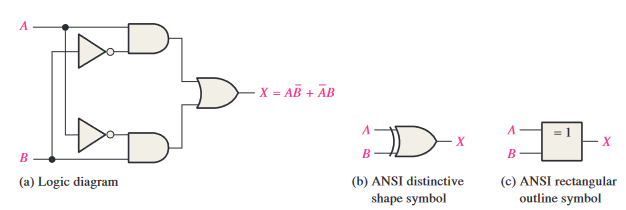
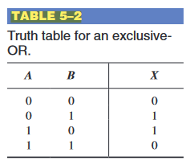
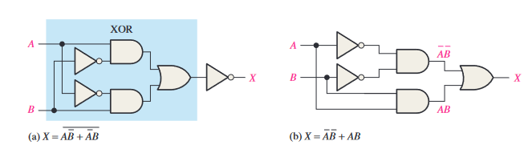
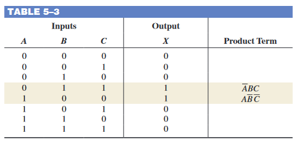
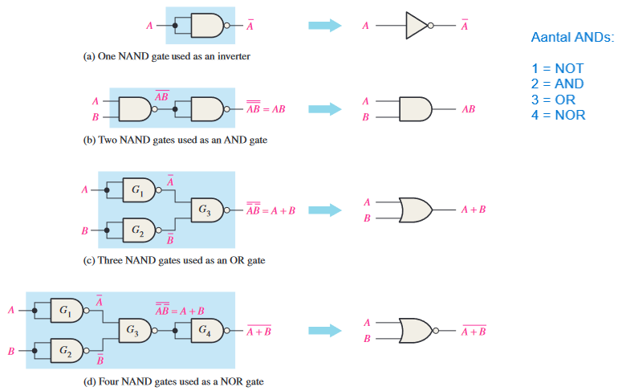
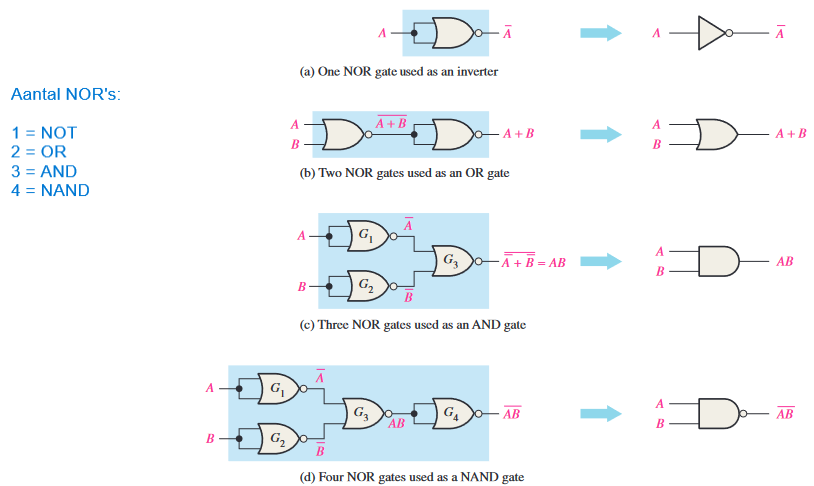
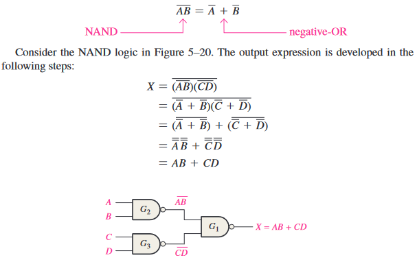
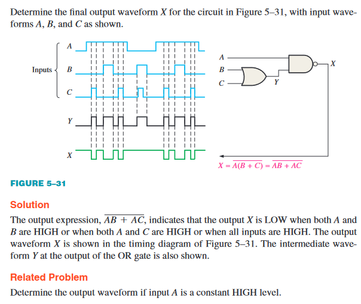

# 5 - Combinational Logic Analysis

## 1 Basic Combinational Logic Circuits

### AND-OR Logic

For a 4-input AND-OR logic circuit, the output X is HIGH (1) if both input A and input B are HIGH (1) or both input C and input D are HIGH (1).

### AND-OR-Invert Logic

$ X = (\bar{A} + \bar{B})(\bar{C} + \bar{D}) = (\bar{AB})(\bar{CD}) = \bar{\bar{(\bar{AB})(\bar{CD})}} = \bar{\bar{\bar{AB}} + \bar{\bar{CD}}} = \bar{AB + CD} $

### Exclusive-OR Logic

### Exclusive-NOR Logic

## 2 Implementing Combinational Logic

### From a Boolean Expression to a Logic Circuit

Voorbeeld: $ X = AB + CDE $

* AB
    * AND-gate
    * Inputs: 
        * A
        * B
    * Output:
        * S
* CDE
    * AND-gate
    * Inputs:
        * C
        * D
        * E
    * Output:
        * R
* AB + CDE
    * OR-gate
    * Inputs:
        * S
        * R
    * Output:
        * X

### From a Truth Table to a Logic Circuit

The Boolean SOP expression obtained from the truth table by ORing the product terms for which X = 1 is:  
$ X = \bar{A}BC + A\bar{B}\bar{C} $

## 3 The Universal Property of NAND and NOR Gates

### The NAND Gate as a Universal Logic Element

### The NOR Gate as a Universal Logic Element

## 4 Combinational Logic Using NAND and NOR Gates

### NAND Logic

$ \bar{AB} = \bar{A} + \bar{B} $

### NOR Logic

$ \bar{A + B} = \bar{A} + \bar{B} $

## 5 Pulse Waveform Operation

