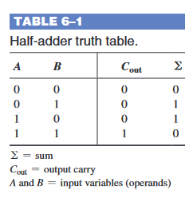
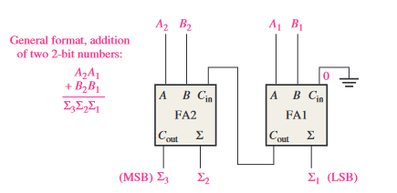
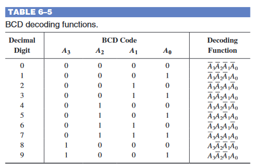
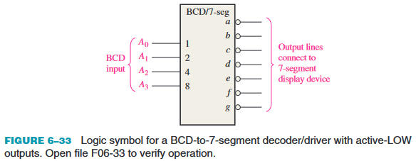

# 6 - Functions of Combinational Logic

## 1 Half and Full Adders

### The Half Adder

* Aanvaardt twee binaire cijfers
* Produceert twee binaire cijfers
    * Een sombit
    * Een carrybit

### The Full Adder

* Aanvaardt twee binaire cijfers en een carry
* Produceert twee binaire cijfers
    * Een sombit
    * Een carrybit

## 2 Parallel Binary Adders

## 5 Decoders

### Basic Binary Decoder

### The 4-Bit Decoder

### The BDC-to-Decimal-Decoder

### The BCD-to-7-Segment Decoder

### Zero Suppression for a 4-Digit Display

## 6 Encoders

### The Decimal-to-BCD Encoder

## 7 Code Converters

### BCD-to-Binary Conversion

### Binary-to-Gray and Gray-to-Binary Conversion

