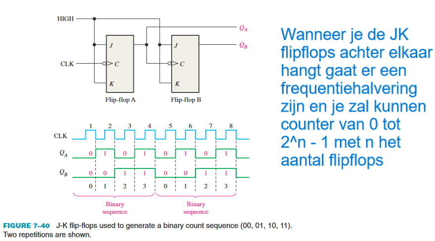

# 7 Latches, Flip-Flops and Timers

## 1 Latches

* Tijdelijk opslagapparaat
    * Bistable

### The S-R (SET-RESET) Latch

### Application

#### The Latch as a Contact-Bounce Eliminator

#### The Gated S-R Latch

#### The Gated D Latch

## 2 Flip-Flops

* Synchrone bistabiele apparaten
* Synchroon
    * Uitgang wijzigt enkel op een specifiek punt op de CLOCK
* Edge-triggered of Edge-sensitive

### The D Flip-Flop

* D hoog
    * Q hoog op trigger van de CLK
    * SET
* D laag
    * Q laag op trigger van de CLK
    * RESET
* Q volgt D op de trigger edge van de CLK

### The J-K Flip-Flop

* J hoog & K laag
    * Q hoog op trigger van de CLK
    * Flip-Flop SET
* J laag & K hoog
    * Q laag op trigger van de CLK
    * Flip-Flop RESET

### Propagation Delay Times

## 4 Flip-Flop Applications

### Parallel Data Storage

### Frequency Division

### Counting

