# 8 Shift Registers

## 1 Shift Register Operations

* Twee basisfuncties
    * Data opslaan
    * Data verschuiven
* Capaciteit
    * Aantal bits dat kan opgeslagen worden

## 2 Serial In/Serial Out Shift Registers

* Seriële data ingang
    * 1 bit
* Seriële data uitgang
    * 1 bit

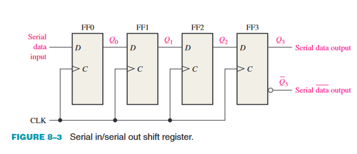

Table 8–1 shows the entry of the four bits 1010 into the register in Figure 8–3, beginning with the least significant bit. The register is initially clear. 
The 0 is put onto the data input line, making D = 0 for FF0. When the first clock pulse is applied, FF0 is reset, thus storing the 0.

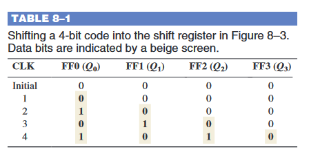

Next the second bit, which is a 1, is applied to the data input, making D = 1 for FF0 and D = 0 for FF1 because the D input of FF1 is connected to the Q0 output. 
When the second clock pulse occurs, the 1 on the data input is shifted into FF0, causing FF0 to set; and the 0 that was in FF0 is shifted into FF1.
The third bit, a 0, is now put onto the data-input line, and a clock pulse is applied. The 0 is entered into FF0, the 1 stored in FF0 is shifted into FF1, and the 0 stored in FF1 is
shifted into FF2. The last bit, a 1, is now applied to the data input, and a clock pulse is applied. 
This time the 1 is entered into FF0, the 0 stored in FF0 is shifted into FF1, the 1 stored in FF1 is
shifted into FF2, and the 0 stored in FF2 is shifted into FF3. This completes the serial entry
of the four bits into the shift register, where they can be stored for any length of time as long
as the flip-flops have dc power.
If you want to get the data out of the register, the bits must be shifted out serially to the
Q3 output, as Table 8–2 illustrates. After CLK4 in the data-entry operation just described,
the LSB, 0, appears on the Q3 output. When clock pulse CLK5 is applied, the second bit
appears on the Q3 output. Clock pulse CLK6 shifts the third bit to the output, and CLK7
shifts the fourth bit to the output. While the original four bits are being shifted out, more
bits can be shifted in. All zeros are shown being shifted in, after CLK8.

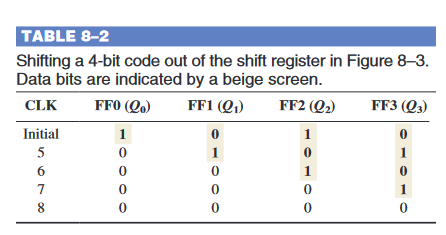

### Serial In/Parallel Out Shift Registers

* Databits worden seriëel ingevoerd zoals bij een SISO
* Databits worden parallel uitgevoerd

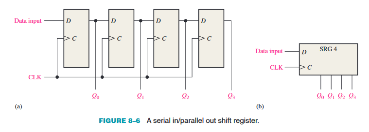

### Parallel In/Serial Out Shift Registers

* Databits worden parallel ingevoerd
* Databits worden seriëel uitgevoerd

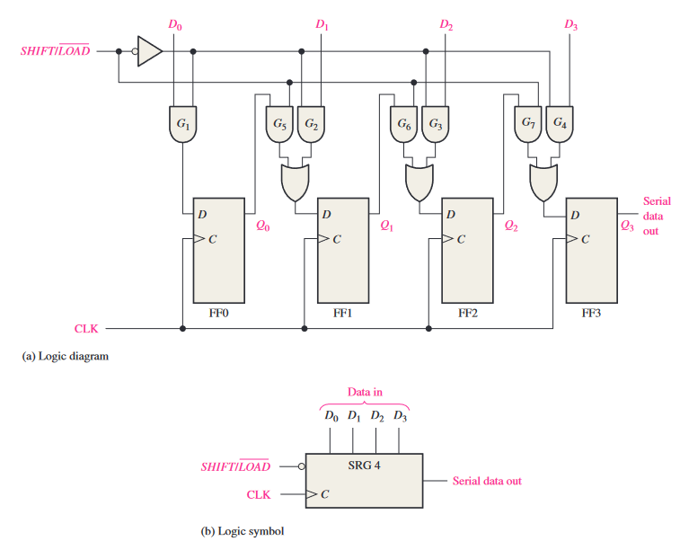

## 3 Bidirectional Shift Registers

* Seriële data ingang
    * 1 bit
* Seriële data uitgang
    * 1 bit
* Bidirectionele data ingang
    * 1 bit
* Bidirectionele data uitgang
    * 1 bit

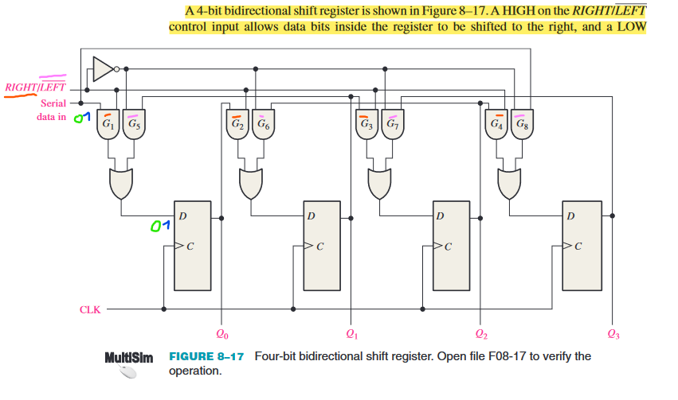

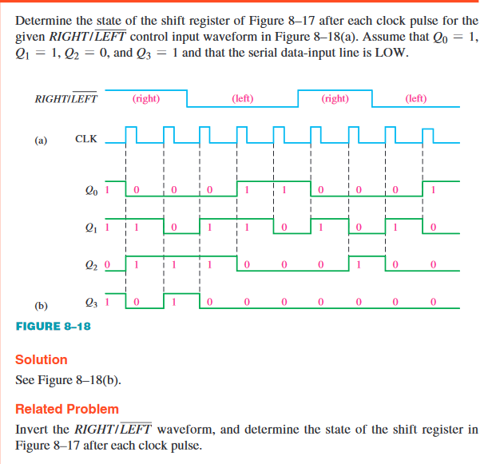

## 4 Shift Register Counters

### The Johnson Counter

* Bidirectionele shift register
* Alle FF's zijn verbonden als een ring
* De uitgang van de laatste FF wordt teruggevoerd naar de ingang van de eerste FF
* De uitgangen van de FF's vormen een Gray code

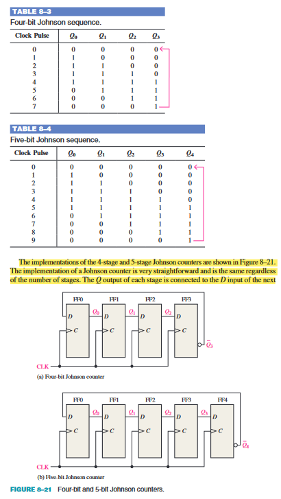

### The Ring Counter

* Bidirectionele shift register
* Alle FF's zijn verbonden als een ring
* De uitgang van de laatste FF wordt teruggevoerd naar de ingang van de eerste FF
* De uitgangen van de FF's vormen een binair getal

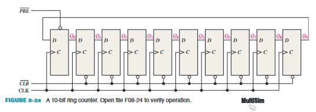
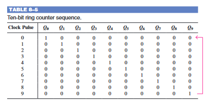

## 5 Shift Register Applications

### Time Delay

* Een shift register kan gebruikt worden om een tijdvertraging te creëren
* De tijdvertraging is afhankelijk van het aantal FF's in het register
* De tijdvertraging is afhankelijk van de klokfrequentie

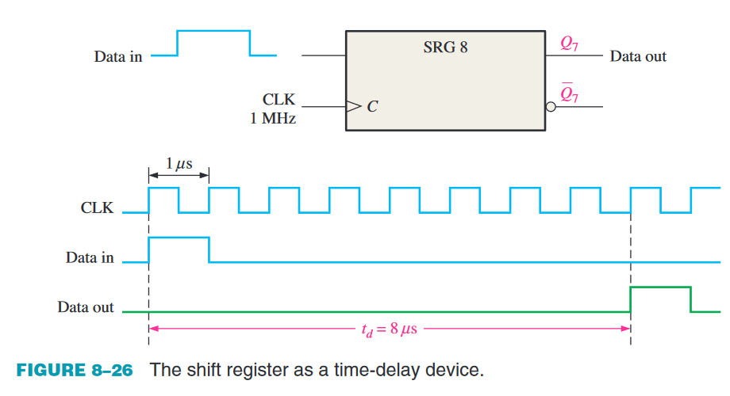

### Serial-to-Parallel Converter

* Een shift register kan gebruikt worden om seriële data om te zetten naar parallelle data
* De data wordt seriëel ingevoerd
* De data wordt parallel uitgevoerd

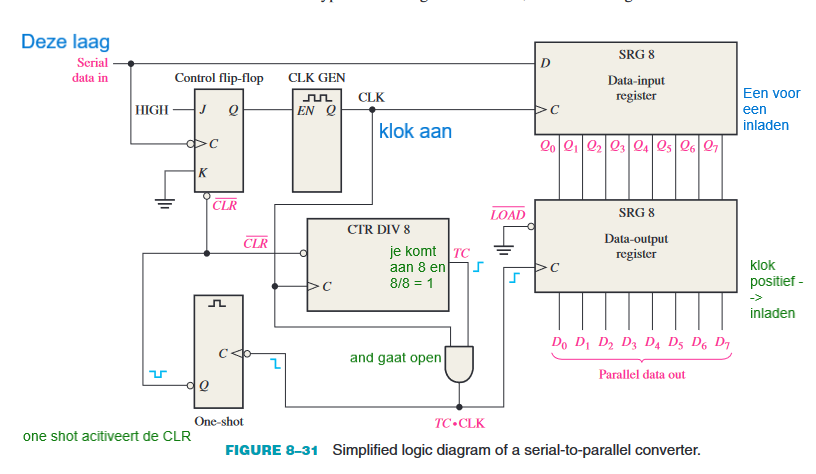

### Universal Asynchronous Receiver/Transmitter (UART)

* Een UART is een IC dat gebruikt wordt om seriële data om te zetten naar parallelle data en omgekeerd
* Een UART wordt gebruikt om data te verzenden en te ontvangen via een seriële verbinding

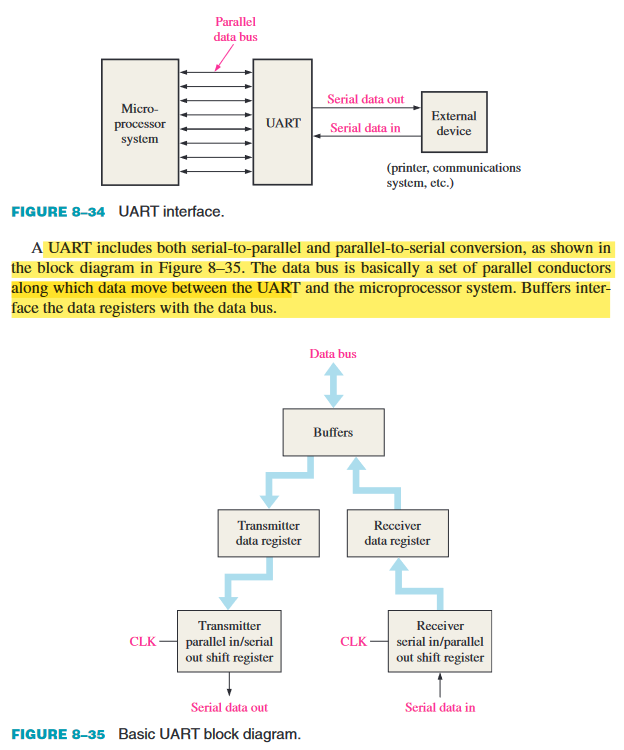