# 9 Counters

## 1 Finite-State Machines

* Gelimiteerd aantal toestanden
* Toestand wordt bepaald door de huidige toestand en de ingangen

## 2 Asynchronous Counters

* Asynchroon
    * Uitgangen wijzigen op verschillende tijdstippen
* Asynchrone teller
    * Uitgangen wijzigen op verschillende tijdstippen
    * Uitgangen wijzigen op de trigger edge van de klok

### A 2-Bit Asynchronous Binary Counter

* 2 FF's
* 2 ingangen
    * CLK
    * RESET
* 2 uitgangen
    * Q0
    * Q1

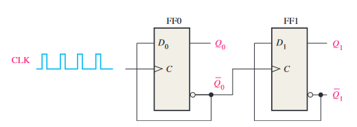

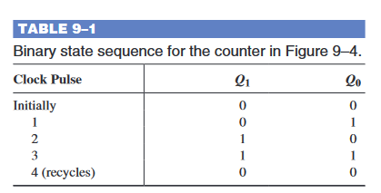

### A 3-Bit Asynchronous Binary Counter

* 3 FF's
* 2 ingangen
    * CLK
    * RESET
* 3 uitgangen
    * Q0
    * Q1
    * Q2

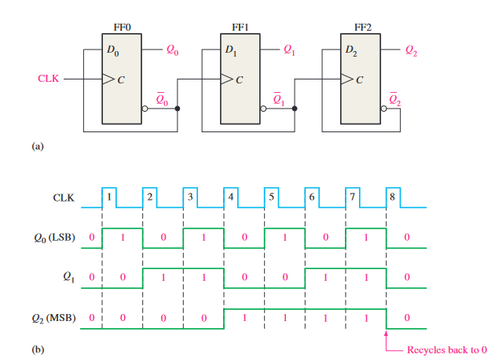

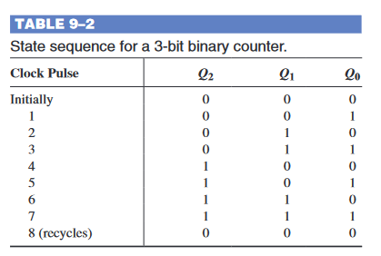

### Propagation Delay

* De tijd die nodig is om de uitgangen te wijzigen
* De tijd die nodig is om de uitgangen te stabiliseren

### Asynchronous Decade Counters

* 4 FF's
* 2 ingangen
    * CLK
    * RESET
* 4 uitgangen
    * Q0
    * Q1
    * Q2
    * Q3

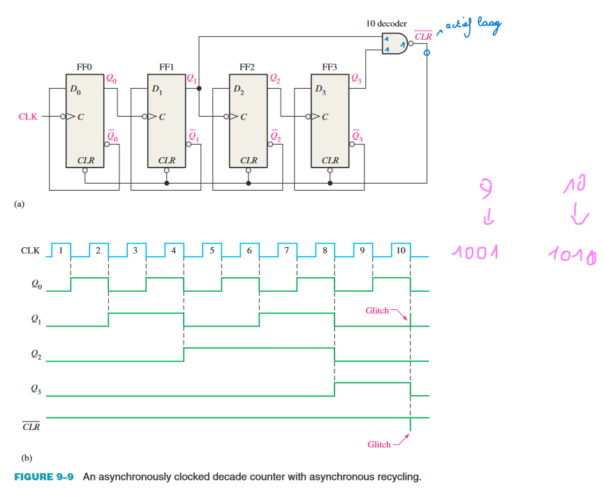

## 3 Synchronous Counters

* Synchroon
    * Uitgangen wijzigen op hetzelfde tijdstip
* Synchrone teller
    * Uitgangen wijzigen op hetzelfde tijdstip
    * Uitgangen wijzigen op de trigger edge van de klok

### Belangrijk verschil tussen synchrone en asynchrone tellers

* Synchrone teller
    * Zelf logica toevoegen
* Asynchrone teller
    * Geen logica toevoegen
    * Snelheid is beperkt door de snelheid van de FF's
    * Propagatietijd optellen

### A 2-Bit Synchronous Binary Counter

* 2 FF's
* 1 ingang
    * CLK
* 2 uitgangen
    * Q0
    * Q1

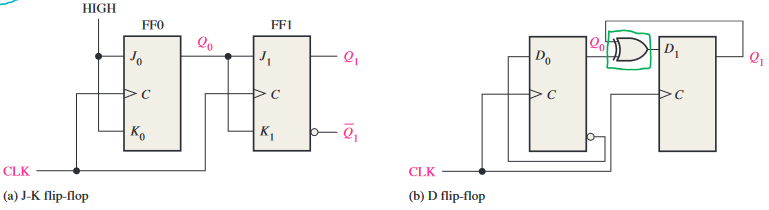

### A 3-Bit Synchronous Binary Counter

* 3 FF's
* 1 ingang
    * CLK
* 3 uitgangen
    * Q0
    * Q1
    * Q2

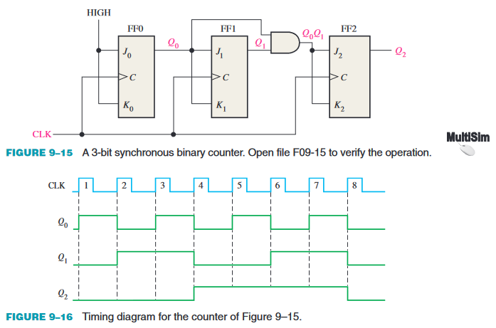

### A 4-Bit Synchronous Binary Counter

* 4 FF's
* 1 ingang
    * CLK
* 4 uitgangen
    * Q0
    * Q1
    * Q2
    * Q3

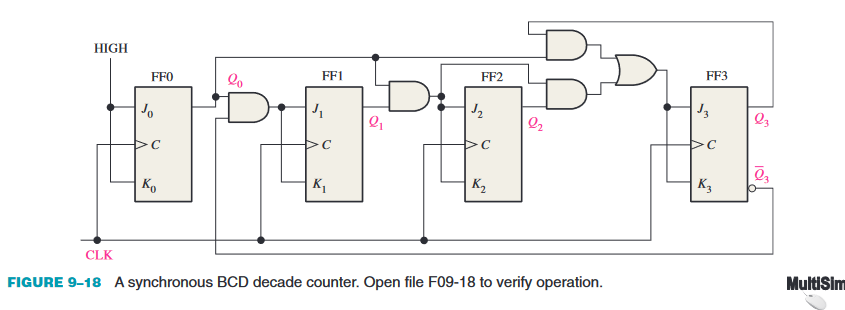
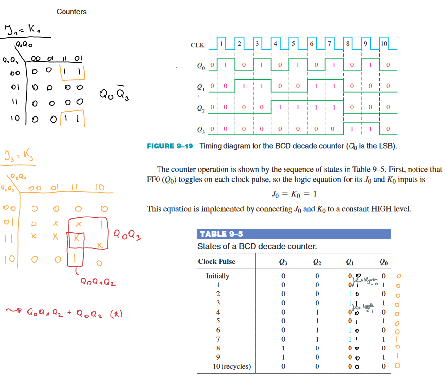

## 4 Up/Down Synchronous Counters

* Up/Down teller
    * Telt op of af
    * Telt op bij een bepaalde ingang
    * Telt af bij een andere ingang

### A 3-Bit Up/Down Synchronous Binary Counter

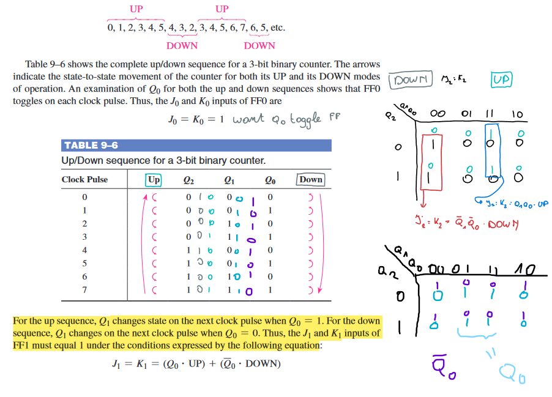

## 5 Design of Synchronous Counters

### Step 1: State Diagram

* Bepaal het aantal toestanden
* Bepaal de toestandsnamen
* Bepaal de toestandsovergangen
* Bepaal de uitgangen

### Step 2: Next-State Table

* Bepaal de volgende toestand
* Bepaal de uitgangen

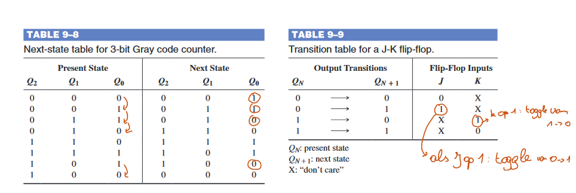

### Step 3: Flip-Flop Transition Table

* Bepaal de volgende toestand
* Bepaal de uitgangen

### Step 4: Karnaugh Maps

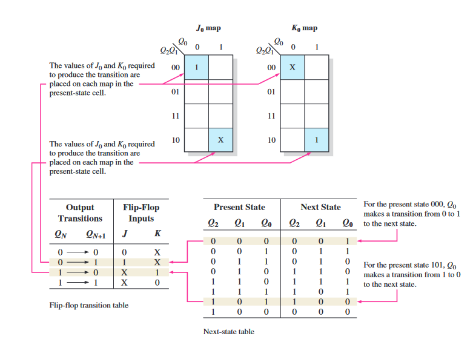

### Step 5: Logic Expressions for Flip-Flop Inputs

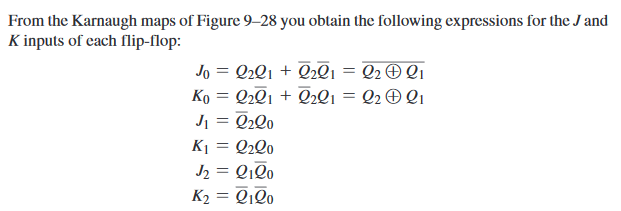

### Step 6: Counter Implementation

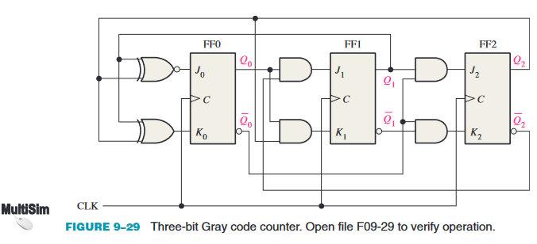

## 6 Cascaded Counters

* Cascaded counters
    * Meerdere tellers in cascade
    * De uitgang van de ene teller is de klok van de volgende teller

## 7 Counter Decoding

* Counter decoding
    * De uitgangen van een teller decoderen
    * De uitgangen van een teller gebruiken als ingangen van een AND-poort
    * De uitgangen van een teller gebruiken als ingangen van een OR-poort

