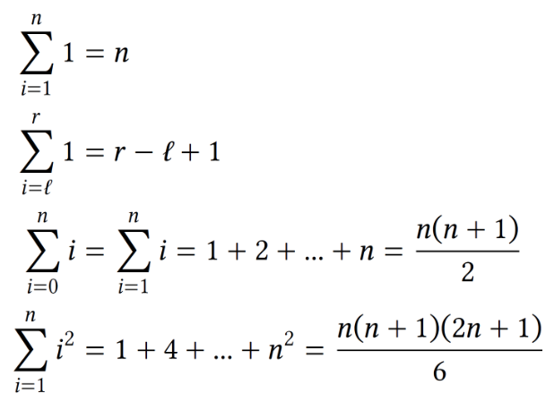
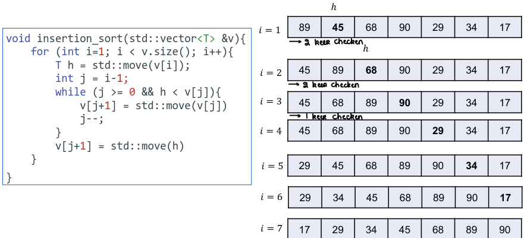

# Analyse van iteratieve algoritmen

## Wat is een iteratief algoritme?

Een algoritme waarbij geïtereerd zal worden door middel van for- of while-loops.

## Stappenplan voor iteratieve algoritmen

1. Definieer een maat voor de invoergrootte
2. Definieer je kostenmodel: welke basisoperaties?
3. Bepaal of uitvoeringstijd afhankelijk is van waarde van de invoer
4. Stel een sommatie op die uitdrukt hoe vaak de basisoperatie wordt uitgevoerd
5. Werk deze sommatie uit tot een gesloten uitdrukking, of schat af in asymptotische notatie

## Enkele nuttige formules

## Geneste lus

* Twee for-lussen in elkaar genest
* Normaal gezien een efficiëntie van n²
* Blijkbaar kan het ook n * *floor*(lg(n))

## Selection sort

* Selecteer telkens het kleinste element uit de resterende deelrij en verwissel het met het eerste element van die deelrij

## Twee elementen wisselen met swap

* Efficiënt een pointerswap uitvoeren door middel van een bitsgewijze XOR

## Selection sort: Complexiteit

* Swap: (n-1)
* Sleutelvergelijking: (n-1)² - (n-2)(n-1)(1/2)

## Belangrijke aspecten van sorteeralgoritmes

* Ter plaatse sorteren: slechts een *constante* hoeveelheid O(1), bijkomende geheugenruimte nodig
* Stabiel sorteren: oorspronkelijke volgorde van gegevens met gelijke sleutels is niet gewijzigd na sorteren

## Copy vs. move semantics

* Verschil is enkel relevant voor niet-primitieve types

## Insertion sort: basisoperaties

* Steeds *n-1* move-operaties
* Sleutelvergelijking in stopconditie wordt minstens even vaak uitgevoerd als move-operatie in de lus
* Elke operatie in de for-lus maar buiten de while-lus wordt *n-1* keer uitgevoerd: O(n-1) = O(n)
* Complexiteit hangt dus af van het aantal keer dat de while-lus wordt uitgevoerd

## Beste/Slechtste geval

* Wanneer beste geval?
    * Bij reeds oplopend gesorteerde invoer, of
    * Bij aflopend gesorteerde invoer
* Wanneer slechtste geval?
    * Bij reeds oplopend gesorteerde invoer, of
    * Bij aflopend gesorteerde invoer
* Afhankelijk van wat het algoritme net doet

## Aantal uitvoeringen van de while-lus in iteratie *i*

## Aantal sleutelvergelijkingen

* in iteratie 𝑖 wordt de while-lus evenveel uitgevoerd als het aantal inversies van element 𝑣[𝑖]
* wordt de stopconditie van de while-lus 1 keer meer uitgevoerd dan de operaties binnen die lus
* als 𝑣[𝑖] kleiner is dan alle elementen op posities 0 … (𝑖 − 1), wordt enkel stopconditie 𝑗 >= 0 uitgevoerd
* het aantal sleutelvergelijkingen in iteratie 𝑖 is dus maximaal 1 meer dan het aantal inversies van element 𝑣[𝑖]
* het totaal aantal sleutelvergelijkingen is dus gelijk aan het aantal inversies in de invoer plus maximum 𝑛 − 1

## Insertion sort: beste geval

* Tabel staat reeds in stijgende volgorde: geen inversies
* While wordt elke keer gestopt door sleutelvergelijking h < v[i]
* Dus 1 extra sleutelvergelijking bovenop aantal inversies voor elke *i* = 1, ..., *n*-1

* In het beste geval worden *n-1* sleutelvergelijkingen uitgevoerd. Het beste geval is dus Θ(n)

## Insertion sort: slechtste geval

* (n-1)n(1/2) inversies
* while wordt elke keer gestopt door *j* >= 0
* er zijn dus geen bijkomende sleutelvergelijkingen bovenop aantal inversies

* Het slechtste geval is dus Θ(n²)

## Insertion sort: gemiddeld geval Θ(n²)

* Gemiddelde geval behoort tot dezelfde complexiteitsklasse O(n²) als het slechtste geval, maar is dubbel zo snel door de verborgen constante

## Belang van insertion sort

* Indien het aantal inversies slechts 𝑂(𝑛) is, dan blijft insertion sort 𝑂(𝑛)
* Aantal sleutelvergelijkingen blijft immers 𝑂(𝑛)
    * 𝑂(n) iteraties van de while
    * 𝑂(n) bijkomende sleutelvergelijkingen door triggeren stopconditie
* Dit geval komt vaak voor in de praktijk:
    * als aantal inversies per element constant is
    * als een constant aantal elementen 𝑂(𝑛) inversies heeft (gesorteerde tabel achteraan uitbreiden met willekeurige elementen)

## Insertion sort

* Stabiel
* Ter plaatse
* Is O(n²) in het slechtste en gemiddelde geval
* Is O(n) voor reeds gesorteerde of nagenoeg gesorteerde input
* Typisch gebruikt als laatste stap in sorteermethodes, nadat reeks eerst grotendeels gesorteerd werd met een ander algoritme