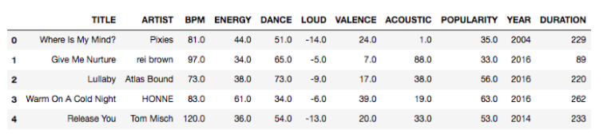

# Meerdimensionale Gegevensstructuren

## Meerdimensionale gegevens: 2-D

* Elk datapunt besaat uit de tuple (latitude, longitude)

## Meerdimensionale gegevens: 4-D

* Elk datapunt bestaat uit de coördinaten van de twee overstaande hoekpunten

## Meerdimensionale sleutels: 6-D

* Elk datapunt bestaat uit de coördinaten van drie hoekpunten van de kubus

## Meerdimensionale gegevens: N-D

## Modelleer als een geometrisch probleem

* Elk gegeven is een punt in een k-dimensionale ruimte
* De coördinaten vormen een meerdimensionale sleutel
* Geen absolute ordening tussen sleutels mogelijk

### Zoekoperatie: Range Search

* Zoek alle punten binnen een bepaald bereik

### Zoekoperatie: K-Nearest Neighbor Search

* Zoek de k dichtstbijzijnde punten
* Voorbeelden:
    * Vind de k meest gelijkaardige producten
    * Vind de k meest gelijkende nummers

### Uitdagingen

* Geen absolute ordening tussen sleutels
* Is de spreiding van de punten volgens elke dimensie ongeveer gelijk?

## Inverted Index

* Een index die de locatie van woorden in documenten bijhoudt

### Projectie

* Gegevensstructuur per dimensie
* Doorzoek sequentieel alle punten die binnen zijde van zoekrechthoek volgens die dimensie liggen
    * Zoek hoeveel punten in range volgens elke dimensie en overloop kleinste set
* Indien punten gelijkmatig verdeeld: 1 gegevensstructuur volstaat

### Rasterstructuur

* Gelinkte lijst per rastergebied met punten die in gebied liggen
* Punten opsporen binnen gegeven hyperrechthoek:
    * Zoek alle gelinkte lijsten van gebieden die overlappen met zoekgebied
    * Evalueer alle punten in geselecteerde gelinkte lijsten

* Als ik de zijde van mijn raster vergroot, krijg ik minder gelinkte lijsten, maar meer punten per gelinkte lijst (langere lijsten)

### Point Quadtree

* Voeg punten 1 voor 1 toe
* Elk punt splitst de ruimte in 2^k gebieden (hyperrechthoeken, evt. halfopen)
* Het aantal knopen neemt toe volgens O(n*2^k)
* Zoeken en toevoegen zijn in het slechtste geval O(n)

#### Cel van een knoop

* Elke knoop is de wortel van een deelboom die alle punten bevat binnen de *cel* van die knoop

### Point-Region Quadtrees

* Verdeel totale gebied recursief in 4 gelijke delen
* Elke inwendige knoop = 1 splitspunt

* Verdeel recursief in 4 gelijke hyperrechthoeken
* Opsplitsing tot elk deelgebied maximum 1 punt bevat
* Inwendige knopen bevatten enkel een coördinaat en corresponderen met een
cel
* Bladknopen zijn leeg of bevatten 1 sleutel
* Fijnere opdeling in gebieden met hogere puntendensiteit

#### Hoogte van een PR-Quadtree

* Onrechtstreeks verband met aantal punten
* Rechtstreeks verband met verhouding kleinste afstand tussen 2 punten en grootte van het gebied

* Langste zijde *z*
* Max. afstand tussen twee punten: *z* * √(2)* / 2^*d*

#### Range Query op PR-Quadtree

* Recursieve oproep per knoop
    * Controleer basisgeval: knoop is bladknoop
        * Retourneer individueel punt als het in zoekgebied ligt, anders lege lijst
    * Controleer basisgeval: zoekrechthoek overlapt niet met cel
        * Retourneer lege lijst
    * Recursieve oproepen voor elk deelgebied
        * Voeg resultaten samen