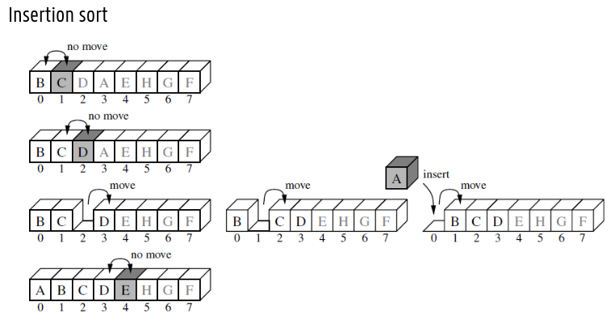

# Recursieve Algoritmen

## Ontwerpprincipes

* Recursie: los probleem op door kleinere versies van hetzelfde probleem
    * 1 deelprobleem: Decrease-and-conquer
    * 2 of meer deelproblemen:
        * Deelproblemen overlappend?
            * Ja: Dynamisch programmeren
            * Nee: Divide-and-conquer

## 1 deelprobleem

* Decrease-and-conquer
```cpp
int factorial(int n) {
    if (n==0) // basisgeval
        return 0;
    return n*factorial(n-1); // recursieve oproep
}
```

## 2 deelproblemen

* Divide-and-conquer

```cpp
int somBinaireRecursie(const vector[int]& v, int start, int stop) {
    if (start >= stop) // basisgeval 1
        return 0;
    if (start == (stop-1)) // basisgeval 2
        return v[start]

    int mid = start + (stop-start)/2 // recursieve oproepen
    return somBinaireRecursie(v, start, mid) + somBinaireRecursie(v, mid, stop)
}
```

# Decrease & Conquer

## Definities

* Verminder met een constante term: $T(n) = T(n-c)+f(n)$
* Verminder met een constante factor: $T(n)=T(\frac{n}{b})+f(n)$
* Verminder met een variabele factor: $T(n)=T(\frac{n}{b_i})+f(n)$

## Verminderen met een constante term

* Algemene vorm:
    * Totaal aantal basisoperaties: $T(n)=$
    * Aantal basisoperaties in de recursieve oproep: $T(n-c)$
    * Aantal basisoperaties in niet-recursieve deel: $+ f(n)$

### Insertion sort



## Verminderen met een constante factor

### Binair zoeken

* Vind de positie *j* van element *key* in een reeds oplopend gesorteerde tabel

### Varianten op binair zoeken

* Zoek sleutel *y* in gerangschikte sequentie van onbekende lengte $x_1$, $x_2$
    * Zoek kleinste *j* uit rij $x_1$, $x_2$, $x_4$, $x_8$, $x_16$ ... waarvoor $x_j$ groter dan of gelijk aan y is
    * We weten dat $x_{j/2}$ kleiner is dan $y$ en $y$ kleiner dan of gelijk aan $x_j$ is
    * Zoek binair in deeltabel $x_{j/2+1}, ... , x_{j}$
    * is $O(lg(j) + lg(j))$

## Selectie-operatie

Zoek het *kde kleinste element van *n* elementen (1 <= k <= n)
* Vereist ook het zoeken van *k-1* kleinere elementen

### Lomuto partitionering

* Lomuto partitionering doet altijd *n-1* sleutelvergelijkingen

### Quickselect 

Gevraagd: het k-de kleinste element (1 ≤ 𝑘 ≤ 𝑛)
1. Partitioneer volgens Lomuto → pivot staat nu op positie 𝑠
2. Vergelijk 𝑘 met 𝑠
    * 𝑠 = 𝑘 − 1 → element gevonden
    * 𝑠 > 𝑘 − 1 → zoek recursief in linkse deeltabel naar 𝑘-de kleinste element
    * 𝑠 < 𝑘 − 1 → zoek in recursief in rechtse deeltabel naar (𝑘 − 𝑠 − 1)-de kleinste element

### Efficientie in het beste en slechtste geval

1. Invoermaat: aantal elementen 𝑛
2. Basisoperatie: sleutelvergelijking (niet indexvergelijking > of ==)
3. Uitvoeringstijd hangt af van waarde van de invoer
4. Schrijf de uitvoeringtijd als recurrente betrekking
5. Werk uit tot gesloten uitdrukking