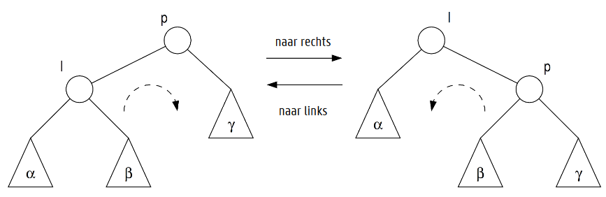
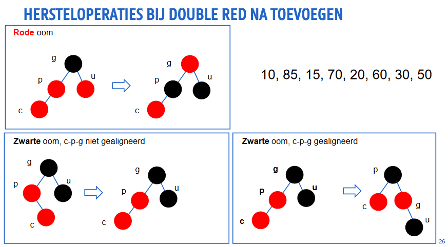

# Red Black Trees

## Woordenboekoperaties op binaire zoekboom

* De complexiteit van alle woordenboekoperaties is O(h)

## Hoe maak ik een zoekboom efficiënt?

* Hoogte afhankelijk van toevoervolgorde

1. Maak elke individuele operatie efficiënt door boom te herbalanceren
2. Maak elke reeks operaties efficiënt
3. Maak gemiddelde efficiëntie onafhankelijk van operatievolgorde

## Definitie

Binaire zoekboom, waarvoor geldt:
1. Elke knoop is rood of zwart
2. De wortel is zwart
3. Elke inwendige knopen bevatten gegevens
4. Elke virtuele knoop (NIL) is zwart
5. Als een knoop rood is, zijn beide kinderen zwart
6. Voor elke knoop is de padlengte naar de virtuele knopen (NIL) in elk deel van de boom gelijk

## Eigenschappen

* Hoogte van een knoop x
    * aantal takken in langste pad van x tot bladknoop in deelboom
* Zwarte hoogte van een knoop x
    * aantal zwarte knopen op elk pad van x naar een bladknoop

## Bewijs over hoogte (toe te voegen)

## Woordenboekoperaties

### Zoeken

* Zoeken in een RBT is hetzelfde als zoeken in een BST
* Complexiteit: O(h) = O(log n)

* Zoeken naar willekeurige sleutel
* Zoeken naar voorloper of opvolger
* Zoeken naar grootste of kleinste sleutel

### Toevoegen

### Rotatie

* Herbalanceren van hoogtes deelbomen, met behoud van eigenschappen zoekboom
* Kind wordt geroteerd "boven" zijn ouder

### Double Red

* Als ouder en kind rood zijn, dan is ook grootouder rood
* Oplossing: kleurverandering en rotatie

### Verwijderen

1. Bepaal knoop y die verwijderd moet worden
2. Herstel voorwaarden van red-black tree

### Verwijder sleutel Z in binaire zoekboom

* z heeft geen kinderen
    * verwijder z door ouder naar NIL te laten wijzen
* z heeft één kind
    * verwijder z door ouder naar kind van z te laten wijzen
* z heeft twee kinderen
    * zoek voorloper of opvolger y van z
    * verwissel z en y
    * verwijder y

### Verwijderen in RBT

* Te verwijderen knoop is rood en heeft geen (echte) kinderen
    * verwijderen is eenvoudig
    * geen verdere actie nodig
* Te verwijderen knoop is zwart en heeft één rood en één virtueel kind
    * maak rode knoop zwart
    * geen verdere actie nodig
* Geen echte kinderen
    * maak "dubbelzwarte" NIL en werk weg
    * geen verdere actie nodig