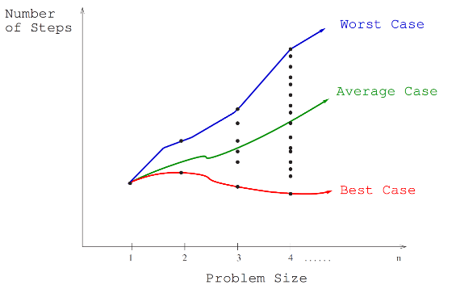
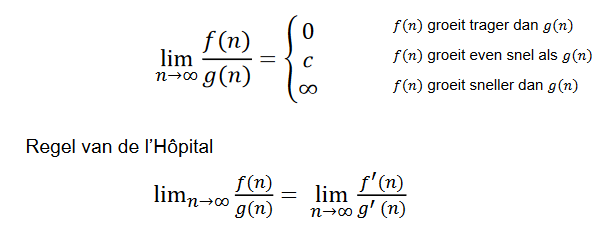
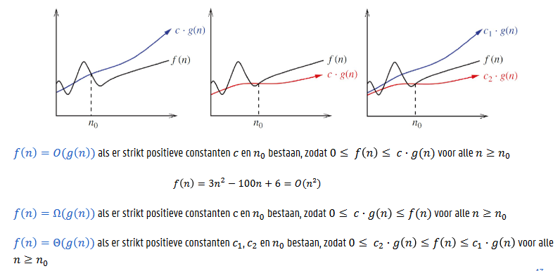
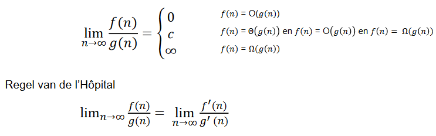

# Efficiëntie van algoritmen

## Het RAM-model

* Model van een hypothetische single-core computer zonder parallelisme
* Primitieve operatie vereist een constant aantal processorcycli
* Primitieve operaties:
    * Toewijzen van een object
    * Wiskundige bewerking
    * Indexeren in een tabel (geheugentoegang)
    * Oproepen van een functie
    * ..

De tijdsefficiëntie van een algoritme drukken we uit als een functie 𝑇(𝑛) die het aantal RAM-primitieve operaties geeft dat wordt uitgevoerd op een invoer met grootte 𝑛.

## Kostenmodel

De tijdsefficiëntie van een algoritme drukken we uit als een functie 𝑇(𝑛) die het aantal ~~RAM-primitieve operaties~~ basisoperaties uit ons kostenmodel geeft dat wordt uitgevoerd
op een invoer met grootte 𝑛

* Basisoperaties zijn:
    * operaties die het frequenst worden uitgevoerd, en/of
    * karakteristieke operaties voor een algoritme

## Beste, gemiddelde en slechtste geval

## Orde van toename

* We zijn vooral geïnteresseerd in:
    * de relatieve toename van de uitvoeringstijd met de invoer
    * de relatieve vergelijking tussen twee algoritmen voor dezelfde invoergrootte
* Verschil tussen twee algoritmes wordt vooral belangrijk bij zeer grote invoergroottes
* We bestuderen daarom enkel de snelst toenemende term: de
orde van toename
* Dezelfde technieken bruikbaar voor twee vragen:
    * Wat is de snelst toenemende term voor grote 𝑛 in de uitvoeringstijd?
    * Welke uitvoeringstijd neemt het snelst toe?

## Limietberekening

## Big-Oh-notatie

## Limietberekening

