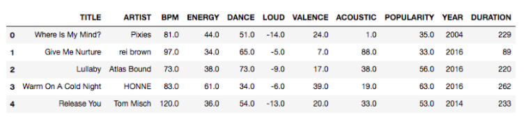

# Meerdimensionale Gegevensstructuren

## Meerdimensionale gegevens: 2-D

* Elk datapunt besaat uit de tuple (latitude, longitude)

## Meerdimensionale gegevens: 4-D

* Elk datapunt bestaat uit de coördinaten van de twee overstaande hoekpunten

## Meerdimensionale sleutels: 6-D

* Elk datapunt bestaat uit de coördinaten van drie hoekpunten van de kubus

## Meerdimensionale gegevens: N-D

## Modelleer als een geometrisch probleem

* Elk gegeven is een punt in een k-dimensionale ruimte
* De coördinaten vormen een meerdimensionale sleutel
* Geen absolute ordening tussen sleutels mogelijk

### Zoekoperatie: Range Search

* Zoek alle punten binnen een bepaald bereik

### Zoekoperatie: K-Nearest Neighbor Search

* Zoek de k dichtstbijzijnde punten
* Voorbeelden:
    * Vind de k meest gelijkaardige producten
    * Vind de k meest gelijkende nummers

### Uitdagingen

* Geen absolute ordening tussen sleutels
* Is de spreiding van de punten volgens elke dimensie ongeveer gelijk?

## Inverted Index

* Een index die de locatie van woorden in documenten bijhoudt

### Projectie

* Gegevensstructuur per dimensie
* Doorzoek sequentieel alle punten die binnen zijde van zoekrechthoek volgens die dimensie liggen
    * Zoek hoeveel punten in range volgens elke dimensie en overloop kleinste set
* Indien punten gelijkmatig verdeeld: 1 gegevensstructuur volstaat

### Rasterstructuur

* Gelinkte lijst per rastergebied met punten die in gebied liggen
* Punten opsporen binnen gegeven hyperrechthoek:
    * Zoek alle gelinkte lijsten van gebieden die overlappen met zoekgebied
    * Evalueer alle punten in geselecteerde gelinkte lijsten

* Als ik de zijde van mijn raster vergroot, krijg ik minder gelinkte lijsten, maar meer punten per gelinkte lijst (langere lijsten)

### Point Quadtree

* Voeg punten 1 voor 1 toe
* Elk punt splitst de ruimte in 2^k gebieden (hyperrechthoeken, evt. halfopen)
* Het aantal knopen neemt toe volgens O(n*2^k)
* Zoeken en toevoegen zijn in het slechtste geval O(n)

#### Cel van een knoop

* Elke knoop is de wortel van een deelboom die alle punten bevat binnen de *cel* van die knoop

### Point-Region Quadtrees

* Verdeel totale gebied recursief in 4 gelijke delen
* Elke inwendige knoop = 1 splitspunt

* Verdeel recursief in 4 gelijke hyperrechthoeken
* Opsplitsing tot elk deelgebied maximum 1 punt bevat
* Inwendige knopen bevatten enkel een coördinaat en corresponderen met een
cel
* Bladknopen zijn leeg of bevatten 1 sleutel
* Fijnere opdeling in gebieden met hogere puntendensiteit

#### Hoogte van een PR-Quadtree

* Onrechtstreeks verband met aantal punten
* Rechtstreeks verband met verhouding kleinste afstand tussen 2 punten en grootte van het gebied

* Langste zijde *z*
* Max. afstand tussen twee punten: *z* * √(2)* / 2^*d*

#### Range Query op PR-Quadtree

* Recursieve oproep per knoop
    * Controleer basisgeval: knoop is bladknoop
        * Retourneer individueel punt als het in zoekgebied ligt, anders lege lijst
    * Controleer basisgeval: zoekrechthoek overlapt niet met cel
        * Retourneer lege lijst
    * Recursieve oproepen voor elk deelgebied
        * Voeg resultaten samen

#### Toepassing: Composite Tiling/Slippy Map

* Tegelstructuur voor kaarten
* Tegels worden opgevraagd volgens zoomniveau
* Tegels worden opgevraagd volgens x- en y-coördinaat
* Tegels worden opgevraagd volgens zoomniveau, x- en y-coördinaat

#### Toepassing: Map Marker Clustering

* Clustering van markers op kaart
* Clustering van markers op kaart volgens zoomniveau
* Clustering van markers op kaart volgens zoomniveau en kaartgebied

#### Toepassing: Frustrum Culling

* Verwijderen van onzichtbare objecten in 3D-omgeving
* Verwijderen van onzichtbare objecten in 3D-omgeving volgens camerapositie
* Verwijderen van onzichtbare objecten in 3D-omgeving volgens camerapositie en kijkrichting

#### Nadeel van Quadtrees (point en point-region)

* In *k* dimensies heeft elke node 2^k kinderen
* k=20: 1 miljoen kinderen per node

### K-D Trees

* Vermijdt de hoge vertakkingsgraad van quadtrees door op elk niveau te splitsen volgens 1 dimensie
* Afwisselen tussen de dimensies als we afdalen in de boom: default alternerend maar kan complexer
* De toevoegvolgorde van de punten bepaalt de vorm van de boom
* Als twee invoervolgordes van dezelfde N gegevens leiden tot dezelfde
boomstructuur, dan is ook de opdeling van de zoekruimte dezelfde

#### Hoe KD-Tree opbouwen?

* Gegevens vooraf gekend
    * Splits volgens dimensie met de grootste spreiding
    * Kies mediaan volgens die dimensie als wortel van de deelboom
* Gegevens niet vooraf gekend
    * Regelmatig reconstrueren van ganse boom

### Range Search Query

* Recursieve oproep op knoop
    * Controleer basisgeval: knoop is bladknoop
        * Retourneer individueel punt als het in zoekgebied ligt, anders lege lijst
    * Controleer basisgeval: zoekrechthoek overlapt niet met cel
        * Retourneer lege lijst
    * Recursieve oproepen voor elk deelgebied
        * Voeg resultaten samen
* Complexiteit hangt af van aantal resultaten *r* (maar impact is beperkt):
    * Perfect gebalanceerde boom - slechtste geval is O(r + k*n^(1-1/k))
    * Willekeurig opgestelde boom - gemiddelde geval in 2D is O(r + n^(0.56))

### K-Nearest Neighbor Query

* Naïeve aanpak: zoek alle punten in range en sorteer volgens afstand
    * O(n) + O(n log n)
* Dichtste buur kan veraf liggen in de boom

#### Nearest Neighbour

"Slimme" recursie doorheen boom, volgens 3 belangrijke concepten:
* Sla het beste tussenresultaat op; en geef dit steeds mee bij recursieve oproepen op kinderen
* Snoeien: doorzoek geen deelboemen die je zeker geen beter dan je huidige resultaat kunnen opleveren
* Doorloopvolgorde: maximaliseer je kans op een scherp tussenresultaat (en dus snoeien) door de "meest belovende" deelboom eerst te onderzoeken

1. Bereken afstand tussen query punt q en punt behorende bij knoop
2. Update tussenresultaat (minimum afstand + coördinaten) indien beter
3. Indien bladknoop: retourneer tussenresultaat
4. Bepaal volgorde waarin kindknopen bezocht worden
    → Kies eerst die kindknoop met cel aan “dezelfde kant” van q
5. Recursie op eerste kindknoop
6. Update tussenresultaat indien resultaat recursieve oproep beter is
7. Bereken afstand tussen
q en cel van de nog niet bezochte kindknoop
    → Indien afstand kleiner dan huidig beste tussenresultaat --> recursieve oproep op die knoop
8. Update tussenresultaat indien resultaat recursieve oproep beter is
9. Retourneer tussenresultaat

