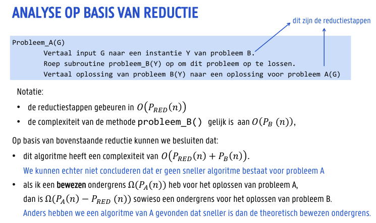
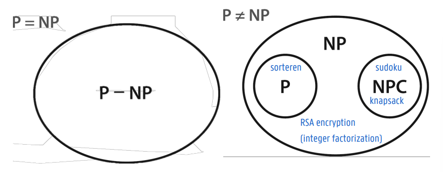
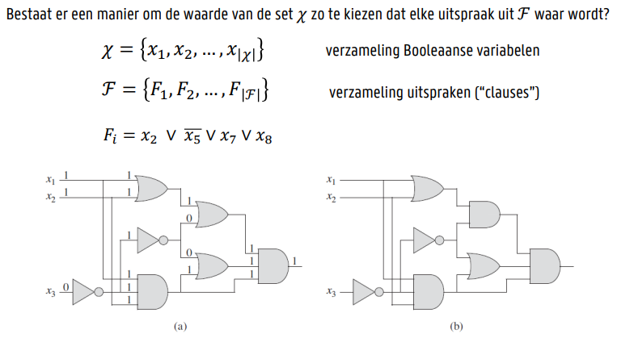
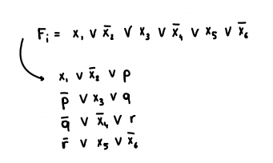
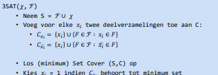
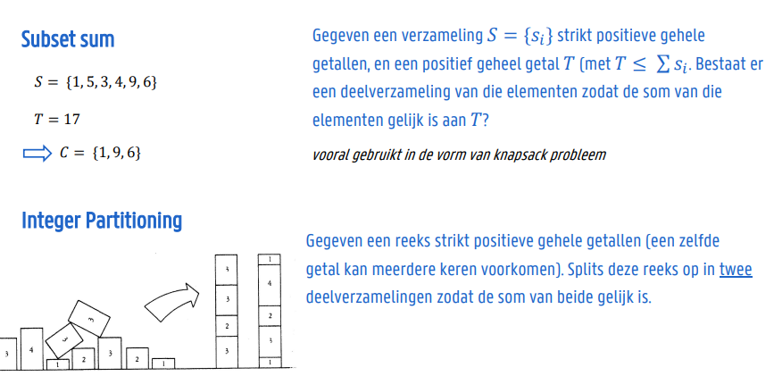

# NP-Complete Problemen

## Het belang van NP-Complete problemen

* Als je niet kan bewijzen dat een probleem NP-Compleet is, dan moet je allicht verder zoeken naar een efficiënt algoritme
* Als je kan bewijzen dat een probleem NP-Compleet is, dan hoef je geen moeite meer te doen om een efficiënt algoritme te vinden

## Beslissingsproblemen

* Een beslissingsprobleem is een probleem waarbij het antwoord ja of nee is

# Complexiteitsklassen

## De klassen P en NP

* **P** = de klasse van beslissingsproblemen die in polynomiale tijd **opgelost** kunnen worden (Polynomial time)
* **NP** = de klasse van beslissingsproblemen waarvan de oplossing in polynomiale tijd **geverifieerd** kan worden (Non-deterministic Polynomial time)

## Waarom leggen we de grens bij polynomiaal?

1. Als de uitvoeringstijd niet kan begrensd worden door een veelterm is het zeker niet efficiënt oplosbaar.
2. Veeltermen vormen de kleinste klasse functies die kunnen gecombineerd worden: som, product of veelterm van veelterm geven opnieuw een veelterm. Elke combinatie van algoritmen met polynomiale uitvoeringstijd resulteert in een algoritme met polynomiale uitvoeringstijd
3. De efficiëntiemaat blijft onafhankelijk van het computermodel en van de voorstelling van de invoer, zolang beide een polynomiale bovengrens
hebben.

# Reductie

## Reducties van algoritmes

* Vertaal een probleem dat je *wil* oplossen naar een probleem dat je *kan* oplossen

## Complexiteitsanalyse op basis van reductie

Complexiteit van dit algoritme is de som van:
* de complexiteit van het gebruikte sorteeralgoritme $O(P_{sorteren}(n))$ én
* de complexiteit van omvormen
    * het originele probleem omvormen naar een sorteerprobleem $O(1)$
  * De oplossing van het sorteerprobleem om te vormen naar een oplossing voor het originele probleem $O(1)$
$=> O(1) + O(P_{sorteren}(n)) + O(1)$

# NP-Complete Problemen

## NP-Compleet

Een beslissingsprobleem is NP-compleet als:
* Het probleem NP is
* <ins>Alle</ins> andere problemen in NP in polynomiale tijd naar dit probleem kunnen worden gereduceerd

* Problemen in $NP$ {$P$ ∩ $NPC$} noemen we $NP$-intermediate

## Het belang van NP-Complete problemen

## Reductie van een hardnekkig probleem

* Hoe bewijs ik dat **mijn probleem** NP-Compleet is?
  * Door een gekend NP-Compleet probleem te reduceren naar **mijn probleem**
  * Aangezien de ondergrens voor het gekende NP-complete probleem algemeen aanvaard is als nietpolynomiaal, zal men ook aanvaarden dat de ondergrens van jouw probleem_B niet-polynomiaal is.

## Reductiestrategie

* Cook’s theorema bewees dat elk mogelijk probleem van NP in polynomiale tijd kan omgezet worden naar het Satisfiability probleem. Dit probleem is dus NP-compleet
* Er wordt algemeen aanvaard (maar nog niet bewezen) dat Satisfiability niet in polynomiale tijd kan opgelost worden

## Het basisprobleem Sat

## Hoe toon je aan dat een probleem NP-Compleet is?

Algemene structuur van het bewijs:
* Geef een reductie vanuit een gekend NP-compleet probleem A naar het aan te tonen probleem B
* Toon de polynomialiteit van de reductiestappen aan
* Toon de geldigheid aan
* Toon aan dat je op basis van een (veronderstelde) oplossing van probleem A altijd een oplossing voor probleem B kan construeren
* Toon aan dat de (vertaalde) oplossing van probleem B altijd een oplossing is voor probleem A

## 3-SAT

* 3-SAT is een variant van SAT waarbij elke clausule exact 3 literals bevat
* 3-SAT is NP-compleet
* 3-SAT is een speciaal geval van SAT

### Reductie

* Clause in SAT met slechts 1 literal: introduceer 2 nieuwe variabelen *p* en *q* en voeg 4 clauses toe aan het 3-SAT probleem
* Clause in SAT met precies 2 literals: introduceer 1 nieuwe variabele *p* en voeg 2 clauses toe aan het 3-SAT probleem
* Clause in SAT met precies 3 literals: voeg deze clause toe aan het 3-SAT probleem
* Clause in SAT met k > 3 literals: introduceer k-3 nieuwe variabelen en voeg k-2 clauses toe aan het 3-SAT probleem

### Toepassing: Logic Locking

Aanvaller heeft ter beschikking:
* de lay-out van het Booleanse circuit
* een werkende chip die toelaat input/output waarden te genereren zonder kennis van de sleutel

Brute-force aanval:
* Genereer een clause $F_i$ voor elk input/output paar verkregen via de commerciële chip
* SAT: zoek een assignatie van de sleutelbits zodat elke clause voldaan is

Geavanceerde aanval
* Neem twee mogelijke sleutelwaarden (bv. willekeurig gegenereerd)
* Zoek een inputwaarde die voor beide sleutels een andere output genereert
  * SAT clauses: originele circuit + eis dat output 1 != output2
* Bepaal met de commerciële chip wat de juiste output waarde is
* Voeg extra clauses toe aan het SAT probleem en herhaal

# NP-Complete Problemen met verzamelingen

## Set Cover

* Gegeven een verzameling S en een verzameling C van deelverzamelingen van S. Wat is het **kleinste aantal** deelverzamelingen dat je kan kiezen uit C zodat elk element van S tot minstens 1 van de geselecteerde deelverzamelingen behoort?

## Reductie van 3-SAT naar Set Cover

* $X = \{x_1, x_2, \dots, x_{|x|}\}$
* $F = \{F_1, F_2, \dots, F_{|F|}\}$

## Exact Cover

* Gegeven een verzameling S en een verzameling C van deelverzamelingen van S. Wat is het **kleinste aantal** deelverzamelingen dat je kan kiezen uit C zodat elk element van S tot exact 1 van de geselecteerde deelverzamelingen behoort?

## Coderen van Exact Cover

* Gegeven een verzameling S en een verzameling C van deelverzamelingen van S. Kan ik deelverzamelingen kiezen, zodat elk element van S tot precies 1 van de geselecteerde deelverzamelingen behoort?

## Hitting Set

* Gegeven een verzameling S en een verzameling C van deelverzamelingen van S. Kies zo weinig mogelijk elementen uit S zodat élke deelverzameling in C gerepresenteerd is met minstens 1 element

## NP-Complete Problemen bij verzamelingen

