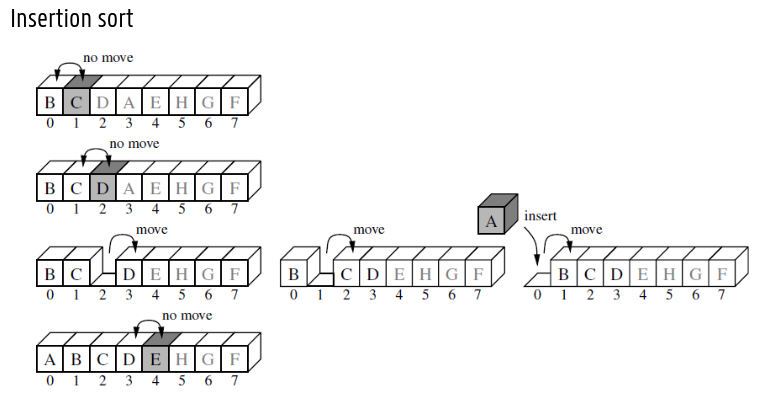
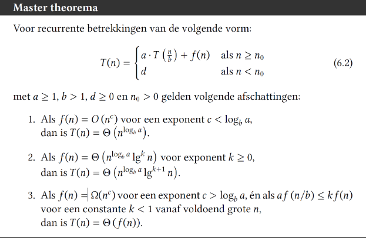
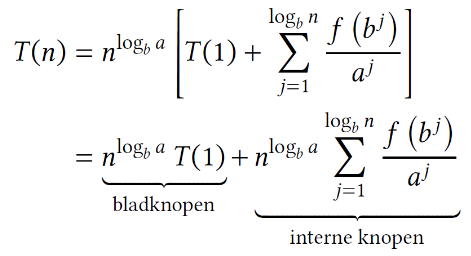

# Recursieve Algoritmen

## Ontwerpprincipes

* Recursie: los probleem op door kleinere versies van hetzelfde probleem
    * 1 deelprobleem: Decrease-and-conquer
    * 2 of meer deelproblemen:
        * Deelproblemen overlappend?
            * Ja: Dynamisch programmeren
            * Nee: Divide-and-conquer

## 1 deelprobleem

* Decrease-and-conquer
```cpp
int factorial(int n) {
    if (n==0) // basisgeval
        return 0;
    return n*factorial(n-1); // recursieve oproep
}
```

## 2 deelproblemen

* Divide-and-conquer

```cpp
int somBinaireRecursie(const vector[int]& v, int start, int stop) {
    if (start >= stop) // basisgeval 1
        return 0;
    if (start == (stop-1)) // basisgeval 2
        return v[start]

    int mid = start + (stop-start)/2 // recursieve oproepen
    return somBinaireRecursie(v, start, mid) + somBinaireRecursie(v, mid, stop)
}
```

# Decrease & Conquer

## Definities

* Verminder met een constante term: $T(n) = T(n-c)+f(n)$
* Verminder met een constante factor: $T(n)=T(\frac{n}{b})+f(n)$
* Verminder met een variabele factor: $T(n)=T(\frac{n}{b_i})+f(n)$

## Verminderen met een constante term

* Algemene vorm:
    * Totaal aantal basisoperaties: $T(n)=$
    * Aantal basisoperaties in de recursieve oproep: $T(n-c)$
    * Aantal basisoperaties in niet-recursieve deel: $+ f(n)$

### Insertion sort



## Verminderen met een constante factor

### Binair zoeken

* Vind de positie *j* van element *key* in een reeds oplopend gesorteerde tabel

### Varianten op binair zoeken

* Zoek sleutel *y* in gerangschikte sequentie van onbekende lengte $x_1$, $x_2$
    * Zoek kleinste *j* uit rij $x_1$, $x_2$, $x_4$, $x_8$, $x_16$ ... waarvoor $x_j$ groter dan of gelijk aan y is
    * We weten dat $x_{j/2}$ kleiner is dan $y$ en $y$ kleiner dan of gelijk aan $x_j$ is
    * Zoek binair in deeltabel $x_{j/2+1}, ... , x_{j}$
    * is $O(lg(j) + lg(j))$

## Selectie-operatie

Zoek het *kde kleinste element van *n* elementen (1 <= k <= n)
* Vereist ook het zoeken van *k-1* kleinere elementen

### Lomuto partitionering

* Lomuto partitionering doet altijd *n-1* sleutelvergelijkingen

### Quickselect 

Gevraagd: het k-de kleinste element (1 ≤ 𝑘 ≤ 𝑛)
1. Partitioneer volgens Lomuto → pivot staat nu op positie 𝑠
2. Vergelijk 𝑘 met 𝑠
    * 𝑠 = 𝑘 − 1 → element gevonden
    * 𝑠 > 𝑘 − 1 → zoek recursief in linkse deeltabel naar 𝑘-de kleinste element
    * 𝑠 < 𝑘 − 1 → zoek in recursief in rechtse deeltabel naar (𝑘 − 𝑠 − 1)-de kleinste element

### Efficientie in het beste en slechtste geval

1. Invoermaat: aantal elementen 𝑛
2. Basisoperatie: sleutelvergelijking (niet indexvergelijking > of ==)
3. Uitvoeringstijd hangt af van waarde van de invoer
4. Schrijf de uitvoeringtijd als recurrente betrekking
5. Werk uit tot gesloten uitdrukking

### Gemiddelde geval

* Kies random spilelement: dit element is het *i*-de kleinste element met kans 1/*n*
* Elke uiteindelijke positie *i* heeft even grote kans 1/*n*

### Interpolerend zoeken

* Zeer gevoelig voor niet-uniforme sleutelverdeling
* Average case *O(lg lg n)* voor aan- en afwezige sleutel
* Worst case *O(n)*
* Enkel bij heel grote tabellen nuttig wegens ingewikkelde berekeningen in herhaling

## Recursieve implementatie

### Signatuur

* Wrapper-functie
* Pass-by-reference
* Recursion at arm's length (shortcircuiting)
    * Controle op basisgeval in het begin van de methode
    * Controle op basisgeval net voor de recursieve oproep
        * Door sommigen beschouwd als anti-pattern
* Recursion at arm's length
    * Geen antipattern bij véél basisgevallen (typisch: bomen)

### Staartrecursies ("tail recursion") wegwerken
= recursie met **enkel** een recursieve oproep als returnwaarde

### Tail-call optimization

* Ondersteund door C++ and Scala compilers
* Niet ondersteund in Cpython interpreter en Java VM

### Omvormen tot staartrecursie

* Werk bottom-up i.p.v. top-down
* = recursieve implementatie met de recursieve oproep als laatste operatie

# Analyse van Meervoudige Recursie

## Analyse van divide-and-conquer

1. Bepaal invoermaat
2. Bepaal de basisoperaties
3. Ga na of uitvoeringstijd afhangt van waarde van de invoer
4. Schrijf de uitvoeringstijd als recurrente betrekking
$T(n) = a * T(\frac{n}{b}) + f(n)$
5. Werk uit tot gesloten uitdrukking met behulp van backwards induction, redeneren op de recursieboom, of het master theorema

## Algemene vorm van de recursieboom

$T(n) = a * T(\frac{n}{b}) + f(n)$

## Master Theorema



## Principe Master Theorema



# Divide-and-conquer

## Matrixvermenigvuldiging

* Twee *n* x *n* matrices met elkaar vermenigvuldigen
    * *n* vermenigvuldigingen x $n²$
    * *n-1* optellingen x $n²$

## Algoritme van Strassen

* Deel matrix op in *n/2* x *n/2* matrices en pas daarop de formule van Strassen toe
* Invoermaat: dimensie *n*
* Kostenmodel: optellingen en vermenigvuldigen van matrices *n* x *n*
* Stel een recurrente betrekking op voor de uitvoeringstijd
* Los op met het mastertheorema

## Mergesort

* zie slides
* Verdeel probleem in deelproblemen tot je een deelprobleem heel eenvoudig kan oplossen
* Voeg gesorteertde deelrijen samen

## Quicksort

* Partitioneer met methode van Hoare
* Zie slides voor de rest

# Transform-and-conquer

* Recursie (los probleem op door deelproblemen op te lossen)
  * Decrease-and-conquer
  * Divide-and-conquer
  * Dynamisch programmeren
* Transform-and-conquer (los probleem op door probleem om te vormen)
  * Zet de invoer in een handigere vorm
  * Stel de invoer op een andere manier voor
  * Vorm het probleem om naar een ander probleem

* Vorm de instantie om
  * Zoeken in ongesorteerde data: binair zoeken in gesorteerde data
  * Zoeken in ongebalanceerde boom: zoeken in gebalanceerde boom
* Sla de gegevens op in andere gegevensstructuur

## Heapsort

* Eigenschappen
  * Compleet binair boom
  * Elke ouder is groter dan zijn kinderen
  * Hoogte van de boom is *O(lg n)*
  * Invoermaat: aantal elementen *n*
  * Basisoperatie: verwisselen van twee elementen
  * Uitvoeringstijd: *O(n lg n)*
  * In-place sorteren
  * Niet-stabiel sorteren
  * Geen recursie
* Algemeen
  * Bouw een heap van de invoer
  * Verwijder de wortel van de heap en plaats deze achteraan in de uitvoer
  * Herstel de heap-eigenschap
  * Herhaal tot de heap leeg is
  
# Uitruil Geheugen - Uitvoeringstijd

## Sleutelvergelijkingen in een volle binairboom

* Structureer de sleutelvergelijkingen in een volle binairboom
  * Inwendige knopen: 1 sleutelvergelijking
  * Uitwendige knopen: gerangschikt eindresultaat
  * n! mogelijke permutaties: n! bladeren

## Ondergrens voor slechtste geval

* = langst mogelijke pad in de boom
* = hoogte van de boom
* n! bladeren: h = n lg n

## Counting sort

### Algoritme (eknel voor *gehele* getallen)

* Alle gegevens zijn gehele getallen
* Min. en max. waarde van de gegevens zijn gekend
  * Indien niet: eerst minimum en maximum bepalen
* Basisprincipe
  * Positie van een sleutel is gekend als aantal sleutels kleiner dan de sleutel gekend is
  * Te verfijnen bij duplicaten

## Bucket sort

* Algemeen
  * Verdeel de invoer in *n* gelijke delen
  * Sorteer de deelrijen
  * Voeg de deelrijen samen

