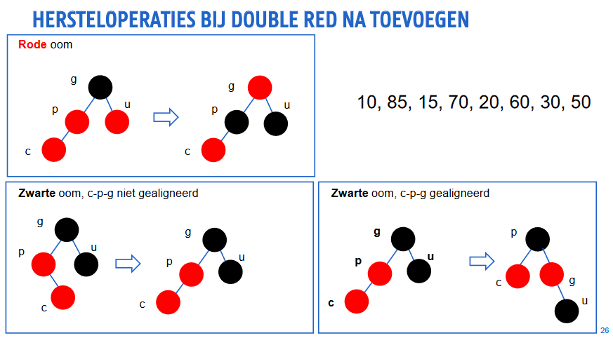
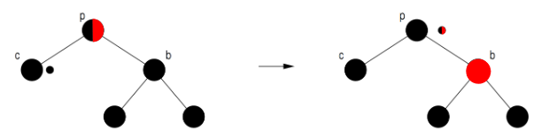
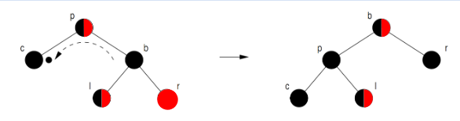
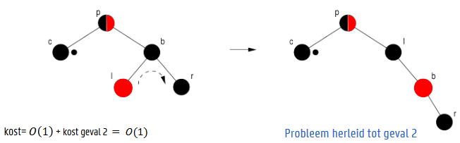
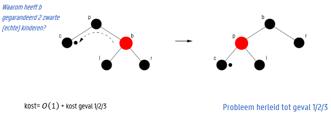

# Red Black Trees

## Woordenboekoperaties op binaire zoekboom

* De complexiteit van alle woordenboekoperaties is O(h)

## Hoe maak ik een zoekboom efficiënt?

* Hoogte afhankelijk van toevoervolgorde

1. Maak elke individuele operatie efficiënt door boom te herbalanceren
2. Maak elke reeks operaties efficiënt
3. Maak gemiddelde efficiëntie onafhankelijk van operatievolgorde

## Definitie

Binaire zoekboom, waarvoor geldt:
1. Elke knoop is rood of zwart
2. De wortel is zwart
3. Elke inwendige knopen bevatten gegevens
4. Elke virtuele knoop (NIL) is zwart
5. Als een knoop rood is, zijn beide kinderen zwart
6. Voor elke knoop is de padlengte naar de virtuele knopen (NIL) in elk deel van de boom gelijk

## Eigenschappen

* Hoogte van een knoop x
    * aantal takken in langste pad van x tot bladknoop in deelboom
* Zwarte hoogte van een knoop x
    * aantal zwarte knopen op elk pad van x naar een bladknoop

## Bewijs over hoogte (toe te voegen)

## Woordenboekoperaties

### Zoeken

* Zoeken in een RBT is hetzelfde als zoeken in een BST
* Complexiteit: O(h) = O(log n)

* Zoeken naar willekeurige sleutel
* Zoeken naar voorloper of opvolger
* Zoeken naar grootste of kleinste sleutel

### Toevoegen

### Rotatie

* Herbalanceren van hoogtes deelbomen, met behoud van eigenschappen zoekboom
* Kind wordt geroteerd "boven" zijn ouder

### Double Red

* Probleem: rode ouder *p* van pas toegevoegde rode knoop *c*
    * Rode ouder *p* is zeker geen wortel
    * Rode ouder *p* heeft zwarte ouder *g*
* Oplossing: kleurverandering of rotatie

### Complexiteit van toevoegen

* Daal af tot juiste invoegpositie zoals in BST
    * O(h) = O(log n)
* Herstel de voorwaarden van de RBT bij double red
    * Knoop *c* en *p* zijn rood
    * Knoop *c* heeft een **rode** oom *u*
        * Kleurverandering van *p*, *u* en *g* met eventueel nieuwe double red
    * Knoop *c* heeft een **zwarte** oom *u*
        * *c*, *p* en *g* zijn op één lijn: rotatie *p* boven *g* en kleurverandering
        * *c*, *p* en *g* zijn niet op één lijn: rotatie *c* boven *p* en rotatie *c* boven *g* en kleurverandering

### Verwijderen

1. Bepaal knoop y die verwijderd moet worden
2. Herstel voorwaarden van red-black tree

### Verwijder sleutel Z in binaire zoekboom

* z heeft geen kinderen
    * verwijder z door ouder naar NIL te laten wijzen
* z heeft één kind
    * verwijder z door ouder naar kind van z te laten wijzen
* z heeft twee kinderen
    * zoek voorloper of opvolger y van z
    * verwissel z en y
    * verwijder y

### Verwijderen in RBT

* Te verwijderen knoop is rood en heeft geen (echte) kinderen
    * verwijderen is eenvoudig
    * geen verdere actie nodig
* Te verwijderen knoop is zwart en heeft één rood en één virtueel kind
    * maak rode knoop zwart
    * geen verdere actie nodig
* Geen echte kinderen
    * maak "dubbelzwarte" NIL en werk weg
    * geen verdere actie nodig

* Herstel voorwaarden van RBT
    * zorg dat zwarte hoogte van deelbomen gelijk blijft
    * zorg dat geen twee rode knopen op een pad staan

* Wegwerken van dubbelzwarte knoop *c* met ouder *p* en broer *b*
    1. zwarte *b* heeft twee zwarte kinderen
        * schuif zwart van *c* en *b* naar *p* 
        

    2. zwarte *b* heeft één rood buitenkind *r* (en rood/zwart binnenkind)
        * rotatie *b* boven *p* en kleurwissel van *p* en *b*, maak *r* zwart
        
    3. zwarte *b* heeft een zwart buitenkind *r* en rood binnenkind *l*
        * rotatie *l* boven *b*, kleurwissel van *l* en *b* + vorig geval
        
    4. rode *b*
        * rotatie *b* boven *p* en kleurwissel van *p* en *b* + geval 1/2/3
        

### Complexiteit van verwijderen

1. Bepaal knoop y die verwijderd moet worden
    * O(h) = O(log n)
2. Herstel voorwaarden van red-black tree
    * Fysiek te verwijderen knoop is rood: stop
    * Fysiek te verwijderen knoop is zwart en heeft 1 rood kind + 1 NIL: vervang knoop door rood kind
    * Fysiek te verwijderen knoop is zwart en heeft 2 NIL kinderen: vervang knoop door dubbelzwarte NIL

* Worst case: 
    * Afdalen tot diepste knoop: O(h) = O(log n)
    * O(lg n) verschuivingen naar omhoog + herkleuringen (geval 1)
    * geval 2/3/4: max. 3 rotaties en 2 kleurwisselingen, elk in O(1) tijd

### Zoekoperaties die gebruik maken van de ordening

#### Select Operatie

Zoek het k-de grootste element in de boom (k=1,2,3,...)

#### Augmented Tree

* Bijkomende gegevens in de knopen om specifieke queries sneller te kunnen uitvoeren
* Voorbeelden:
    * aantal knopen in deelboom
    * som van sleutels in deelboom
    * minimum van sleutels in deelboom
    * maximum van sleutels in deelboom
    * ...

#### Select Operatie in Augmented Tree

* Basisidee:
    * r = aantal elementen in linkerdeelboom + 1
    * k = r + 1: retourneer huidige knoop
    * k < r + 1: zoek in linkerdeelboom naar k-de element
    * k > r + 1: zoek in rechterdeelboom naar (k-r)-de element