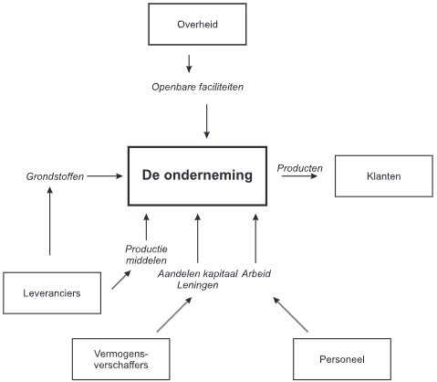

# 1 De Onderneming

## 1.1 Ondernemen

* Ondernemingszin:
    * Intrapreneurship: ondernemingszin binnen een bestaande organisatie
    * Entrepreneurship: ondernemingszin om een eigen onderneming op te starten
    * Ondernemingszin is een combinatie van:
        * Nieuwe initiatieven nemen
        * Deze initiatieven uitvoeren

* Pakket eigenschappen die iemand tot een ondernemer maken:
    * Zelfstandigheid
    * Ontwikkelingen in de markt herkennen
    * Innovatief zijn
    * Kansen zien en grijpen
    * Netwerken met andere collega-ondernemers
    * Leiding willen geven & nemen
    * Risico's durven nemen

* De ondernemer:
    * Ziet kansen
    * Benut kansen
    * Creëert waarde
        * Meer dan enkel winst & geld

## 1.2 Ondernemen is produceren

* Produceren:
    * Combineren productiemiddelen tot een hogere waarde
        * Arbeidskrachten
        * Grondstoffen
        * Kapitaalgoederen
        * Ondernemerschap
* *Output* > *Input*
    * Meerwaarde creëren
    * Opbrensten > Kosten

* Investeringsgoederen: goederen die gebruikt worden om andere goederen te produceren

* Organisaties opdelen in:
    * Profitorganisaties
        * Winst is het doel
        * Producten of diensten verkopen
    * Non-profitorganisaties
        * Winst is niet het doel
        * Culturele, sociale, wetenschappelijke doelen

## 1.3 Ondernemingsmodel

* Stakeholders:
    * Alle partijen die betrokken zijn bij de onderneming
    * Belanghebbenden
    * Interne & externe stakeholders
    * Belangen kunnen conflicteren

* Onderneming zet *inputs* om in *outputs* waarbij er binnen de onderneming *toegevoegde waarde* wordt gecreëerd

* Functies:
    * Technisch-commercieel
        * Combinatie van inputs tot outputs
        * Deze outputs (producten of diensten) worden aan klanten geleverd
    * Financieel-economisch
        * Gelden ontvangen van klanten en betalen aan leveranciers, werknemers, ...

