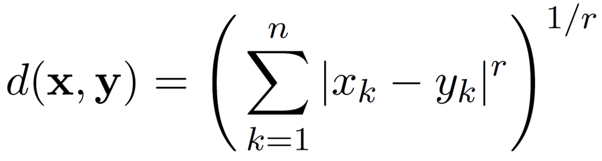

# Data and data preparation

## Data - Distributed data processing

### Setting

#### Large-scale data is everywhere

* Enormous data growth in both commercial and scientific databases
* New mantra
    * Gather whatever data you can whenever and wherever you can
* Expectations
    * Gathered data will have value either for the purpose collected or for some other purpose

### Data Mining

#### Why data mining? Commercial P.O.V.

* Lots of data is being collected and stored
* Computers have become cheaper and more powerful
* Competitive pressure is strong
    * Provide better, customized services for an edge (e.g. personalized marketing)

#### Why data mining? Scientific P.O.V.

* Data collected and stored at enormous speeds
    * Remote sensors on a satellite
    * Telescopes scanning the skies
    * ...
* Data mining helps scientists
    * In automated scientific data analysis
    * In hypothesis formation

#### What is data mining?

* Non-trivial extraction of implicit, previously unknown, and potentially useful information from data
* Exploration & analysis, by automatic or semi-automatic means, of large quantities of data in order to discover meaningful patterns
* Discover models that are:
    * **Valid**: hold on new data with some certainty
    * **Useful**: should be possible to act on
    * **Unexpected**: non-obvious
    * **Understandable**: humans should be able to interpret the pattern

#### Data mining: cultures

* Data mining overlaps with
    * Databases: large-scale data, simple queries
    * Machine learning: *small* data, complex models
    * Computer Science theory: algorithms
* Different cultures
    * To a DB person, data mining is an extreme form of analytic processing - queries that examine large amounts of data
    * To a ML person, data-mining is the interference of models

#### Data mining tasks

* Prediction Methods
    * Use some variables to predict unknown or future values of other variables
* Description Methods
    * Find human-interpretable patterns that describe the data

#### Predictive: classification

* Find a model for class attribute as a function of the values of other attributes

#### Examples of a classification task

* Classifying credit card transactions as legitimate or fraudulent
* Classifying land covers (water bodies, urban areas, forests, etc.) using satellite data
* Categorizing news stories as finance, weather, entertainment, sports, etc.
* Identifying intruders in cyberspace
* Predicting tumor cells as benign or malignant

#### Classification: Fraud Detection

* Goal: predict fraudulent cases in credit card transactions
* Approach:
    * Use credit card transactions and the information on its account-holder as attributes
    * When does a customer buy, what does he buy, how often he pays on time ...
    * Label past transactions as fraudulent or fair transactions
    * Learn a model for the class of the transactions
    * Use this model to detect fraud by observing credit card transactions on an account

#### Classification: Sky Survey Cataloging

* Goal: to predict class of sky objects, especially visually faint ones
* Approach:
    * Segment the image
    * Measure image attributes
    * Model the class based on these futures
    * Succes story: found 16 new high red-shift quasars

#### Predictive: Regression Analysis

* Predict a value of a given continuous valued variable based on the values of other variables, assuming a linear or non-linear model of dependence
* Extensively studied in statistics, neural network fields
* Examples
    * Predicting sales amounts of new products based on advertising expenditure
    * Predicting wind velocities as a function of temperature, humidity, air pressure, etc.

#### Descriptive: Clustering

* Find groups of items that are similar among themselves but are different from the items in other groups

#### Clustering Applications

* Understanding
    * Grouping genes that have similar expression patterns
    * Grouping proteins with similar functionality
    * Custom profiling for target marketing
* Summarization
    * Reducing the size of large data sets

#### Clustering: Market Segmentation

* Goal: subdivide a market into distinct subsets of customers where any subset may conceivably be selected as a market target to be reached with a distinct marketing mix
* Approach:
    * Use customer information to segment the market
    * Use the segments to target the marketing mix

#### Descriptive and Predictive: Association Rules

* Given a set of records each containing a number of items from a collection
* Produce dependency rules predicting occurrence of an item based on occurrences of other items

#### Association Analysis: Applications

* Market basket analysis
    * Rules are used for sales promotion, shelf management and inventory management
* Telecommunication alarm diagnosis
    * Rules are used to find combination of alarms that frequently occur together
* Medical Informatics
    * Rules are used to find associations between diseases and symptoms

#### Descriptive: Deviation / Anomaly / Change Detection

* Find significant deviations from normal behavior
* Examples
    * Detecting credit card fraud
    * Detecting faults in a system
    * Detecting intruders in a computer network

### Attribute Types and Dataset Types

#### Data Definitions

* **Attribute**: a property or characteristic of an object
* **Data object**: a collection of attributes describe one
* **Attribute values**: the set of possible values for an attribute
* **Data**: a collection of data objects and their attributes

#### Types of Attributes

* **Nominal**: values from an unordered set
    * E.g. blood type, eye color
* **Ordinal**: values from an ordered set
    * E.g. grades, job titles
* **Interval**: values from an ordered set of equal-size intervals
    * E.g. temperature in Celsius
* **Ratio**: values from an ordered set of equal-size ratios

#### Properties of Attribute Values

* Mapped to attribute types
    * **Nominal** attribute: distinctness
    * **Ordinal** attribute: distinctness, order
    * **Interval** attribute: distinctness, order, meaningful differences
    * **Ratio** attribute: distinctness, order, meaningful differences and ratios

#### Discrete and Continuous Attributes

* **Discrete**: finite or countably infinite set of values
    * E.g. social security number, zip code, number of cars in a household
* **Continuous**: an interval of real numbers
    * E.g. temperature, height, weight

#### Types of Datasets

* Record
    * Data matrix
    * Document data
    * Transaction data
* Graph
    * World Wide Web
    * Molecular structure
* Ordered
    * Spatial data
    * Temporal data
    * Sequential data
    * Genetic sequence data
* Important characteristics: dimensionality, sparsity, size

#### Record Data

* Data that consists of a collection of records, each of which consists of a fixed set of attributes

#### Record: Data Matrix

* Same fixed set of numeric attributes
* Represented by an m x n matrix
    * m rows: objects
    * n columns: attributes

#### Record: Document Data

* Each document becomes a 'term' vector
    * Each term is a component of the vector
    * The value of the component is the frequency of the term in the document

#### Record: Transaction Data

* Each transaction is a record
* Each transaction consists of a set of items

#### Graph Data

* Data that consists of a collection of records, each of which consists of a collection of nodes and edges

#### Ordered Data

* Data that consists of a collection of records, each of which consists of an ordered set of attributes

### Data Similarity and Dissimilarity Measures

#### Similarity and Dissimilarity Measures

* Similarity measure
    * Numerical measure of how alike two data objects are
    * Higher value means more similar
* Dissimilarity measure
    * Numerical measure of how different two data objects are
    * Lower value means more similar

#### Euclidean Distance

* n is the number of dimensions
* Normalization is necessary, if scales differ

#### Normalization

* Data scaled to fall within a small, specified range
* E.g. [0, 1] or [-1, 1]

#### Min-Max Normalization: Outliers Problematic

* Min-Max Normalization
    * Downside: does not handle outliers well

#### Z-Score Normalization

* Avoids the problem of outliers
* (value - mean) / standard deviation
    * Below mean: negative
    * Above mean: positive

#### Minkowski Distance

* Generalization of Euclidean distance

#### Common Properties of a Distance

* d(x, y) ≥ 0 for all x and y and d(x, y) = 0 only if x = y (positive definiteness)
* d(x, y) = d(y, x) for all x and y (symmetry)
* d(x, z) ≤ d(x, y) + d(y, z) for all points x, y, and z (triangle inequality)

#### Common Properties of a Similarity

* s(x, y) = 1 if x = y 
* s(x, y) = s(y, x) for all x and y (symmetry)

#### Density

* Measures degree to which data objects are close to each other in a specified area
* Notion of density is closely related to that of proximity
* Concept of density is typically used for clustering and anomaly detection
* Examples
    * Eucledian density 
        * Number of points within a given radius
    * Graph-based density
        * Connectivity of a point to its neighbors

#### Euclidean Density: Grid-based

* Simplest approach is to divide region into a number of rectangular cells of equal volume and define density as # of points in the cell

#### Euclidean Density: Center-based

* Density of a point is the number of points within a given radius

### Data Preprocessing

#### Why Data Preprocessing?

* Data in the real world is *dirty*
    * Incomplete: lacking attribute values, lacking certain attributes of interest, or containing only aggregate data
    * Noisy: containing errors or outliers
    * Inconsistent: containing discrepancies in codes or names
* No quality data, no quality mining results
    * Quality decisions must be based on quality data
    * Example: a classification model for detecting people who are loan risks is built using poor data
        * Credit-worthy people may be denied loans
        * Non-credit-worthy people may be given loans

#### Major Tasks in Data Preprocessing

* Data cleaning
    * Fill in missing values, smooth noisy data, identify or remove outliers, and resolve inconsistencies
* Data integration
    * Integration of multiple databases, data cubes, or files
* Data transformation
    * Normalization and aggregation
* Data reduction
    * Reducing the volume but producing the same or similar analytical results

#### Data Cleaning / Cleansing / Scrubbing

* Dirty data examples
    * Presence of dummy values
    * Absence of fields
    * Contradictions in the data
    * Violation of business rules
    * Reused primary keys
* Data cleaning = process of detecting and correcting / removing corrupt or inaccurate records
    * Inconsistencies may be caused by user error, corruption in transmission / storage, etc.
    * Identifying incomplete, incorrect, inaccurate or irrelevant parts of data
    * Replacing, modifying, deleting this dirty data
    * Can be performed interactively with data wrangling tools
    * Can be performed through batch processing / scripting
* After cleansing a data set should be consistent
* Not only used to clean up the data in a DB but also to bring consistency to different sets of data that have been
merged from separate databases
* Differs from data validation where data is rejected from the system at time of entry, instead of afterwards