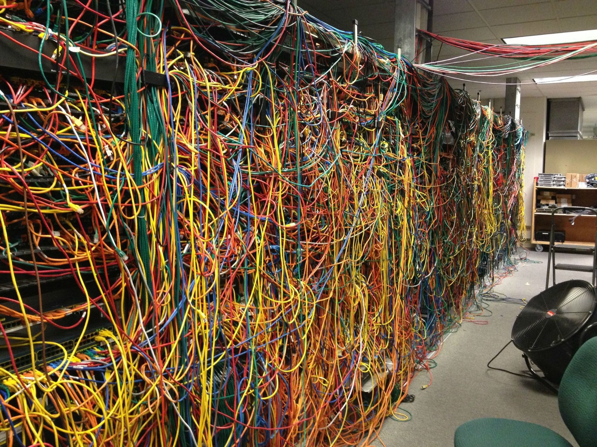

# Replication, partitioning and transactions

# Distributed Data Processing

# Distributed data

* What happens if multiple machines are involved in storage and retrieval of data?
* Reasons
  * Scalability : spread data volume\, read load or write load across multiple machines
  * Fault tolerance / high availability : if your application needs to continue working even if one machine \(or several\, or the network\, or a data center\) goes down\, you can use multiple machines to give you redundancy
  * Latency : if you have users around the world\, you may want to have servers at various locations worldwide so that each user can be served from a datacentre geographically close to them

# Motivation: Google Example

* 20\+ billion web pages x 20KB = 400\+ TB
* 1 computer reads 30\-35 MB/sec from traditional disk
  * ~4 months to read the web
* ~1\,000 hard drives to store the web
* Takes even more time to do something useful with the data
* Today\, a standard architecture for such problems has  emerged
  * Cluster of commodity \(Linux\) nodes
  * Commodity network \(Ethernet\) to connect them

# Cluster architecture

In 2011 it was  _guesstimated_  that Google had 900k machines\, [http://bit\.ly/Shh0RO](http://bit.ly/Shh0RO)

# IDLab’s Ilab.T

# Scaling to higher load

* Vertical scaling = buy a more powerful machine
  * Shared memory architecture : multiple CPUs all accessing any part of the memory or disk
    * Issues: cost\, non\-linear performance increases\, performance ceiling\, limited fault tolerance\, single geographic location
  * Shared\-disk architecture : several machines with independent CPUs\, data is stored on a shared array of disks interconnected via fast network \(e\.g\. Fiberchannel\)
    * Issues: contention\, overhead of locking

* Horizontal scaling \(a\.k\.a\.  shared\-nothing architectures \): throw more resources at it
  * Each node has its CPUs\, RAM and disks independently
  * Coordination between nodes is done at the software level\, using a conventional network
  * No special hardware required
  * Currently mostly VMs / containers
  * Nodes can be distributed over geographic regions\, reducing latency and potentially allowing to survive the loss of a data center

# Horizontal scaling challenges

* How do you  distribute computational tasks ?
* How can we make it  easy to write distributed programs ?
* How to handle  failures ?
  * One server may stay up 3 years \(1000 days\)
  * If you have 1000 servers\, expect to loose 1/day
  * People estimated Google had ~900k machines in 2011
    * 900 machines fail every day\!

# ClouD computing

* Computing as a utility
  * Utility services: water\, electricity\, gas
  * Consumers pay based on their usage
* Why now?
  * Experience with very large datacenters
    * Unprecedented economies of scale
    * Transfer of risk
  * Technology factors
    * Pervasive broadband internet
    * Maturity in virtualization technology
  * Business factors
    * Minimal capital expenditure
    * Pay\-as\-you\-go billing model

# Replication vs partitioning

* Two common ways of distributing data across multiple nodes
  * Replication
    * Keeping a copy of the same data on several different nodes\, potentially in different locations
    * Provides  redundancy
    * Can help improve  performance
  * Partitioning
    * Splitting a DB into smaller subsets called partitions so that different partitions can be assigned to different nodes
    * Helps improve  performance

# replication

# Replication

* Reasons to replicate data
  * Reduce  latency : keep data geographically close to your users
  * Increase  availability : allow the system to continue working even if parts have failed
  * Increase  throughput : scale out the number of machines that can serve read queries
* Here: assume dataset can be replicated fully to each machine
* If data that needs replicating does not change over time replication is easy\, just copy the data to every node
* Difficulty:  handling replication with changing data

# Leaders and followers

* Each node that stores a copy of the DB is called a  replica
* Multiple replicas: how do we ensure that all data ends up on all replicas?
  * Every write to the DB needs to be processed by every replica
  * Solution:  leader\-based replication  \(a\.k\.a\. master\-slave replication\)
    * One of the replicas is designated as leader \(a\.k\.a\.  master  or  primary \)
      * Clients want to write to DB → send request to leader → leader writes new data to local storage
    * Other replicas are followers \( replicas \,  slaves \,  secondaries \)\.
      * When leader writes new data to local storage → sends data change to all followers as part of a  replication log  or  change stream
      * Each follower takes log from leader and updates local copy of the DB\, applying all writes in the order as they were processed on the leader
    * When a client wants to read from the DB\, it can query either the leader or any of the followers
      * Writes only accepted on the leader \(followers are read\-only for clients\)

# Sync verSus async replication

* Synchronous replication : leader waits until follower has confirmed it received the write
  * Before reporting success to the user
  * Before making the write visible to other clients
  * Follower is guaranteed to have an up\-to\-date copy of the data consistent with the leader
  * If the follower doesn’t respond\, the write cannot be processed
* Asynchronous replication : leaders sends the message\, but does not wait for response from follower
  * If leader fails and is unrecoverable\, any writes that have not yet been replicated to followers are lost
  * Can continue processing writes\, even if all of its followers have fallen behind
* In practice typically a mix: one follower will be synchronous\, the others asynchronous
  * If the synchronous follower becomes unavailable or slow: promote an async follower to sync
  * A\.k\.a\.  semi\-synchronous

# Setting up a new follower

* Take a consistent snapshot of leader’s DB at some point in time
  * Same feature as required for backups
  * If possible without taking a lock on the DB
* Copy snapshot to new follower node
* Follower connects to leader and requests all data changes that happened since snapshot was taken
  * Snapshot must be associated with an exact position in the leader’s replication log
* When follower has processed backlog of data changes since snapshot\, it has caught up
  * Can now continue to process data changes from leader as they happen

# Handling node outages: follower

* Any node in the system can go down
  * Unexpected due to fault
  * Planned maintenance \(e\.g\. rebooting for kernel patch\)
* Goal
  * Keep system as a whole running despite individual node failures
  * Keep impact of node outage as small as possible
* Follower failure:  catch\-up recovery
  * On local disk\, each follower keeps log of data changes it received from leader
  * If a follower goes out
    * From its log it knows the last transaction that was processed before the fault occurred
    * Can request all data changes since that time from the leader
    * When those changes are applied\, it has caught up and can continue receiving a stream of data changes as before

# Handling node outages: Leader

* Leader failure:  failover
  * One of the followers promoted to new leader
  * Clients reconfigured to send their writes to new leader
  * Other followers start consuming data changes from new leader
* Failover can be done  manually  or  automatically
  * Determining that the leader has failed
    * Most systems use a  timeout  – if a system does not respond for an amount of time it is assumed dead
  * Choosing a new leader
    * Can be done through  election process  or new leader can be appointed by a  controller node
    * Best candidate for leadership is usually the replica with the most up\-to\-date data changes
    * Getting all nodes to agree on new leader =  consensus problem
      * Lots of different consensus protocols a\.o\. Paxos\, Bitcoin’s proof\-of\-work\, etc\.
  * Reconfiguring system to use new leader
    * Clients send write requests to new leader
    * When old leader comes back\, it may not realize it was forced to step down
    * System needs to ensure old leader becomes follower and recognizes new leader

# When Failover goes wrong

* If async replication is used\, new leader may not have received all writes from old leader before failure
  * When former leader rejoins\, what should happen with those writes?
    * New leader may have received conflicting writes in the meantime
    * Usually: discard unreplicated writes
* Discarding writes is dangerous if other storage systems coordinate with DB content
  * Example: GitHub incident saw an out\-of\-date MySQL follower promoted to leader
    * DB used autoincrement counter to assign primary keys to new rows
    * New leader reused some primary keys that were assigned by the old leader
    * Those keys were used in a Redis store\, so reuse resulted in inconsistency between MySQL and Redis\, leading to disclosure of private data to wrong users
* In certain scenarios it can happen that two nodes both believe they are leader \(a\.k\.a\.  split brain \)
  * Dangerous if both leaders accept writes and there is no process for resolving conflicts
    * Data likely lost or corrupted
  * Safety catch: some systems have a mechanism to shut down one node if two leaders are detected
    * Can trigger dual leader shutdown if not carefully designed
* What is the  right timeout  before the leader is declared dead?
  * Longer timeout = longer time to recovery in case where leader fails
  * Short timeout = potential for unnecessary failovers

# Problems with replication lag

* Leader\-based replication
  * Requires all writes to go through single node
  * Read\-only queries can go to any replica
* For workloads that consist of mostly reads and only small percentage of writes \(common on the web\) an attractive option is to create many followers and distribute reads across those followers
  * Removes load from leader and allows read requests to be served by nearby replicas
  * A\.k\.a\.  read\-scaling architecture
  * Only realistically works with asynchronous replication
    * Synchronous: single replica node failure holds up whole system for writing
* When application reads from asynchronous follower it may see outdated information if follower has fallen behind
  * Same query on leader versus on fallen behind follower = inconsistent
  * Temporary: stop writing to DB and followers will eventually catch up and become consistent: dubbed  eventual consistency
* Replication lag = delay between write happening on leader and reflected on follower
  * With large lag\, issues for applications start to arise
  * Three main issues discussed next

# Replication Lag issue: Reading your own writes

* When new data is submitted\, it must be sent to leader
* When user views data\, it can be read from a follower
* Asynchronous replication
  * If user views data shortly after making a write\, new data may not yet have reached replica
  * Looks like data submitted was lost

* Requires  read\-after\-write consistency  \(a\.k\.a\. read\-your\-writes consistency\)
  * If user reloads page\, they always see any updates they submitted themselves
  * Makes no promises about other users: other users’ updates may not be visible until some later time
* Implementation
  * When reading what user may have modified: read it from leader\, otherwise read it from follower
    * E\.g\. social network profile is only editable by owner of profile → read user’s own profile from leader\, any other profile from follower
  * If most things are potentially editable by user track time of last update and\, for a configurable time \(e\.g\. based on replication lag\) after last update\, make all reads from leader
  * Client can remember timestamp of most recent write → system makes sure that replica serving reads for that user reflects updates until that timestamp
    * Timestamp can be log sequence number or actual system clock \(requires clock synchronisation\)
* Note: more complications when multi\-device access is considered \(e\.g\. desktop \+ mobile app\)
  * Cross\-device read\-after\-write consistency  required
  * Approaches requiring remembering timestamp of user’s last update become more difficult\, because code running on one device does not know updates that happened on other device \(this metadata will have to be centralized\)
  * If replicas distributed across different datacentres\, no guarantee that connections from different devices will be routed to the same datacentre \(may require having to route all requests from user’s devices to same datacentre\)

# Replication lag ISSUE: Monotonic reads

* Reading from async followers can make users see things moving backward in time
  * If user makes several reads from different replicas
* Monotonic reads  is a guarantee that this kind of anomaly does not happen
  * Lesser guarantee than strong consistency\, but stronger than eventual consistency
  * Guarantees that if user makes several reads in sequence\, they will not read older data after having previously read newer data e\.g\. by making sure user always makes reads from same replica
    * Replica can be chosen based on hash of user ID\, but if that replica fails the user’s queries will need to be rerouted to another replica

# Replication lag issue: Consistent prefix reads

* Imagine following dialog
  * Mr\. Poons: how far into the future can you see Mrs\. Cake?
  * Mrs\. Cake: about ten seconds usually\, Mr\. Poons
* Imagine third person listening to conversation through followers
  * Second sentence goes through follower with little lag\, first sentence has longer replication lag
  * Observer would see as though answer comes before question
* Preventing this anomaly requires  consistent prefix reads
  * Guarantees that if a sequence of writes happens in a certain order\, then anyone reading those writes will see them appear in the same order

# Multi-leader replication

* Only one leader → all writes must go through leader
* Multi\-leader replication  \(a\.k\.a\.  master\-master replication \)
  * Allow more than one node to accept writes
  * Each node that processes a write must forward that data change to all other nodes
* Mostly used in multi\-datacentre configurations
  * Can have a leader in each datacentre
  * Within each datacentre\, regular leader\-follower replication is used
  * Between datacentres\, each datacentre’s leader replicates its changes to leaders in other datacentres

# Comparing single and multi-leader

* In multi\-datacentre deployments
  * Performance
    * Single leader: every write must go over the internet to leader’s datacentre \(can add significant latency\)
    * Multi\-leader: every write can be processed in local datacentre and is replicated asynchronously to other datacentres
  * Tolerance of datacentre outages
    * Single leader: if datacentre with leader fails\, failover can promote a follower in another datacentre to be leader
    * Multi\-leader: each datacentre can continue to operate independently\, replication catches up when failed datacentre comes back online
  * Tolerance of network problems : traffic between datacentres usually goes over public internet\, less reliable than local network within a datacentre
    * Single leader: very sensitive to problems in the inter\-datacentre link\, because writes are made synchronously over this link
    * Multi\-leader: can tolerate network problems better\, temporary network interruption does not prevent writes being processed
* Disadvantage multi\-leader
  * Same data may be concurrently modified in two different datacentres \- those  write conflicts must be resolved
  * Multi\-leader replication often considered dangerous territory \- difficult to get right
* Modern multi\-leader applications
  * Clients with offline operation e\.g\. calendar apps on mobile phone/laptop
    * If you make any changes while you are offline\, they need to be synced with a server and your other devices when the device is online
    * Every device has local DB that acts as leader \(accepts write requests\) and there is an asynchronous multi\-leader replication process \(sync\) between the replicas of your calendar on all your devices
  * Collaborative editing e\.g\. Google Docs: when one user edits a document\, the changes are instantly applied to their local replica and asynchronously replicated to server and any other users who are editing the same document

# Multi-leader write conflicts

* Multi\-leader replication can produce write conflicts
* Upon write conflict: conflict resolution required
  * Conflict resolution algorithms out\-of\-scope

# Multi-leader replication topologies

* Replication topology: describes communication paths along which writes are propagated from one node to another
  * Circular topology : each node receives writes from one node and forwards those writes \(\+ any writes of its own\) to one other node
  * Star topology : one root node forwards writes to all other nodes
  * All\-to\-all : every leader sends its writes to every other leader

# Leaderless replication

* What if we abandon the concept of a leader and allow any replica to directly accept writes from clients?
  * Became fashionable again after Amazon used it for in\-house Dynamo system
    * Cassandra is an open source datastore with leaderless replication models inspired by Dynamo
    * Sometimes called  Dynamo\-style
* Sometimes client sends writes directly to several replicas\, while in others a coordinator node does this on behalf of the client
  * Coordinator does not enforce a particular ordering of writes

# Leaderless Replication: Writing when a node is down

* DB with 3 replicas\, one of the replicas is currently unavailable
  * Client sends write to all 3 replicas in parallel
    * 2 available replicas accept the write\, unavailable one misses it
    * 2 of 3 replicas acknowledge the write\, and user considers write to be successful\, ignoring fact that 1 write was missed
  * Unavailable node comes back online and clients start reading from it
    * Potential for stale / outdated values from that node
  * Solution: when client reads from DB\, request data from several nodes in parallel
    * Client may receive different responses\, version numbers used to determine which value is newer

# Leaderless replication: Read repair and anti-entropy

* Replication scheme should ensure that eventually all data is copied to every replica
* After an unavailable node comes back online it must catch up on missed writes\. Two mechanisms often used
  * Read repair : when a client makes a read from several nodes in parallel\, it can detect stale information\. Client sees that replica 3 has stale value and writes newer value to that replica
  * Anti\-entropy process : background process that constantly looks for differences between replicas and copies any missing data from one replica to another

# Partitioning

* Partitioning: for very large datasets or very high query throughput
  * Need to break data up into partitions a\.k\.a\.  sharding
  * Normally each piece of data belongs to exactly one partition
  * Main reason: scalability
* Partitioning usually  combined with replication  so copies of each partition are stored on multiple nodes

# Partitioning of key-value data

* Goal: spread data and query load evenly across nodes
  * Skewed  = presence of uneven spread
  * Partition with disproportionally high load is called a  hot spot
* Easiest solution would be to distribute data randomly to nodes
  * But when reading\, no way of knowing which node data is on\, so would have to query all nodes in parallel
* Partitioning by key range
  * Assign continuous range of keys \(from some minimum to some maximum\) to each partition
  * Due to known boundaries between ranges\, able to determine which partition contains given key → can make request directly to appropriate node
  * Range of keys  not necessarily evenly spaced \, because data may not be evenly distributed
  * Within partitions keys can be kept in sorted order
    * E\.g\. when key is timestamp\, queries can easily fetch all reading from particular month
    * Downside: when writing data to DB\,  all current writes end up going to same partition  \(serving current time/day\) so partition can be overloaded while others sit idle
    * Can be  resolved by partitioning by means of prefix  \(e\.g\. sensor generating value\) and then by time
      * Downside: when wanting to fetch values of multiple sensors within a time range\, need to perform a separate query for each sensor name

* Partitioning by hash of key
  * Many distributed datastores use a hash function to determine partition for a given key
    * A good hash function takes skewed data and makes it uniformly distributed e\.g\. MD5
    * 32 bit hash function of string returns a seemingly random number between 0 and 232 – 1
  * Downside: lose the ability to do efficient range queries
    * Adjacent keys now scattered across all partitions \(figure below\)
* Compromise can be achieved by declaring  compound primary keys  consisting of multiple columns
  * Only first column of key is hashed to determine partition\, others used as an index for sorting data
  * If a query specifies a fixed value for the first column\, it can perform an efficient range scan over the other columns of the key \(e\.g\. user\_id\, update\_timestamp\) → retrieve all updates made by a particular user within some time interval\, sorted by timestamp

# Skewed workload and hot spotS

* Hashing a key to determine a partition can help reduce hot spots\, but cannot avoid them entirely
  * If most reads / writes are for same key → all requests routed to same partition
    * E\.g\. social media site celebrity does something
* Solution
  * If key is considered to be very hot\, add random number to beginning or end of key\, splitting writes to key evenly
    * Those keys can now be distributed across different partitions
    * Reads now have to do additional work: read data from all partitions and combine them
    * Add overhead to that \(tracking which keys are split and which aren’t\)

# Partitioning and secondary indexes

* What if records are not only accessed by their primary key?
* Secondary indexes : does not identify a record uniquely but rather a way of searching for occurrences of a particular value
  * Examples
    * Find all articles containing the word hogwash
    * Find all cars whose color is red
* Problem: secondary indexes do not map neatly to partitions
* Two approaches
  * Document\-based partitioning
  * Term\-based partitioning

# secondary indexes: by document

* Each partition maintains  own secondary indexes \, covering only documents in that partition
  * Whenever writing to DB → only need to deal with partition that contains document ID that you are writing
  * Also known as  local index  \(instead of global index\)
  * Reading requires care: need to send query to all partitions and recombine results \(a\.k\.a\. scatter/gather\)
  * Widely used\, but can make reads expensive
* Example: operate a website for selling used cars
  * Each listing unique ID \(doc ID\) and DB partitioned by doc ID
  * Users can search for cars filtering by color and make \(both secondary indexes\)
    * DB can be configured to put indexes on color and make

# secondary indexes: by term

* Rather than each partition having own secondary index  construct a global index  covering data in all partitions
  * Unable to store that index on one node as it would become a bottleneck
  * Index itself must be partitioned  but can be partitioned differently from primary key index
* Makes reads more efficient= no more scatter/gather over all partitions
* Writes are slower and more complex
  * Write to a single document may affect all partitions of the index
  * Index not always up to date\, otherwise would need distributed transactions
    * Index updates often asynchronous

# Rebalancing partitions

* Over time things change
  * Query throughput increases: more CPUs needed
  * Dataset size increases: more disks and RAM needed
  * Machine fails\, other machines need to take over failed machine’s responsibilities
* All these changes call for data and requests to be moved from one node to another → this process is called  rebalancing
* Rebalancing goals
  * After rebalancing load should be shared fairly between nodes in cluster
  * While rebalancing is happening\, DB should continue accepting reads and writes
  * No more data than needed should be moved between nodes\, to make rebalancing fast and to minimize network and disk I/O load

# Partition Rebalancing strategies

* Do not do hash mod N
  * Problem: if N changes most keys will need to be moved from one node to another → Excessively expensive
* Fixed number of partitions
  * Create many more partitions than there are nodes and assign several partitions to each node e\.g\. cluster of 10 nodes may be split into 1000 partitions from the start so each node hosts \+/\- 100 partitions
  * If node is added to cluster\, new node steals partitions from every existing node until partitions are fairly distributed again
  * Reverse process if node is removed from cluster
  * Number of partitions and assignment of key to partition does not change
  * Old assignment of partitions is used for any reads/writes that happen while rebalancing transfer is in progress
  * Can account for heterogenous hardware in cluster: more powerful nodes get more partitions

* Dynamic partitioning  \(proportionally to the dataset\)
  * When partition grows over a configurable size\, it is  split into two partitions  so \+/\- half the data ends up on each side of the split
  * If a partition shrinks below some threshold\, it can be  merged with an adjacent partition
  * Benefit: number of partitions adapts to total data volume
  * Drawback: empty DB starts with one partition\, so all writes have to be handled by a single node while other nodes sit idle
    * Resolved by allowing pre\-splitting to a configurable number of partitions
* Partitioning proportionally to nodes
  * Make number of partitions proportional to number of nodes i\.e\. fixed number of partitions per node
    * While number of nodes remains unchanged\, size of each partition grows proportionally to dataset size
    * New node joins the cluster → randomly chooses a fixed number of existing partitions to split and takes ownership of one half of each of those split partitions
      * Partitions become smaller again

# Request routing

* Partitioned our dataset over multiple nodes running on multiple machines
  * When a client wants to make a request\, how does it know which node to connect to?
    * Basically: if I want to read or write the key “foo”\, which IP address and port number do I need to connect to?
* Known as a  service discovery problem
* Approaches
  * Allow clients to contact any node \(e\.g\. via round\-robin load balancer\)
    * If node incidentally owns partition to which request applies\, it can handle request directly\, otherwise forwards request to appropriate node\, receives reply and passes reply to client
  * Send all requests from clients to a routing tier first
    * Determines node that should handle each request and forwards request
    * Routing tier does not handle requests itself\, only acts as partition\-aware load balancer
  * Require that clients be aware of partitioning and assignment of partitions to nodes
    * Allows clients to immediately contact appropriate node without intermediary
* Issue remains: how does component making routing decision learn about changes in assignment of partitions to nodes?

* Many distributed data systems rely on a  separate coordination service  such as Zookeeper to keep track of cluster metadata
  * Each node registers with Zookeeper
  * Zookeeper keeps authoritative mapping of partitions to nodes
  * Routing tier or partition\-aware client subscribe to this information
    * When partition changes ownership or a node is added or removed\, Zookeeper notifies routing tier so that it can keep its routing information up\-to\-date

# Transactions

# The reality of data systems

DB software or hardware may fail at any time \(even in the middle of a write operation\)

Application may crash at any time \(halfway through a series of operations\)

Interruptions in the network can unexpectedly cut off the application from the DB\, or the DB node from another

Several clients may write to the DB at the same time\, overwriting each other’s changes

A client may read data that does not make sense because it has only partially been updated

Race conditions between clients can cause bugs

# Transactions to the rescue

* Transactions mechanism of choice for simplifying these issues
  * Groups several reads and writes into a logical unit
  * Conceptually all reads and writes in a transaction are executed as one operation: either it succeeds \(commit\) or it fails \(abort\, rollback\)
    * If it fails\, application can retry
  * Benefit: no need to worry about partial failure
  * Drawback: performance impact
* Safety guarantees usually described by  ACID  acronym
  * Atomicity : if a transaction was aborted\, the application can be sure that it did not change anything\, so it can be retried
  * Consistency : application\-specific notion of the DB being in a good state e\.g\. in accounting DB credits and debits must be balanced
    * While AID are DB properties\, the C is a pure application property \(and some state it does not belong here\)
  * Isolation : concurrently executing transactions are isolated from each other
    * Rarely used or even implemented in DBs due to performance implications
  * Durability : once a transaction has committed successfully\, any data it has written will not be forgotten

Example ofrace condition

# Transaction concurrency issues: Serializable isolation

* If transactions do not touch the same data\, they can safely be run in parallel because neither depends on the other
* Concurrency issues
  * One transaction reads data that is concurrently modified by another transaction
  * Two transactions try to simultaneously modify the same data
  * Typically triggered when unlucky with timing
* Serializable isolation
  * DB guarantees that transactions have the same effect as if they ran serially \(i\.e\. one at a time\)
  * Incurs heavy performance cost
  * Common for systems to offer weaker levels of isolation

# Transaction isolation: Read committed

* Most basic level of transaction isolation
  * When reading from DB only see data that has been committed \(i\.e\. no dirty reads\)
  * When writing to DB only overwrite data that has been committed \(i\.e\. no dirty writes\)
* No dirty reads
  * Any writes by a transaction only become visible to others when that transaction commits

No dirty reads:user 2 sees new valuefor x only after user 1’s transaction has committed

# No dirty writes

* What happens if two transactions concurrently try to update the same object in a DB
  * Unsure in which order writes will happen but assume later write overwrites earlier
* What happens if earlier write is part of a transaction and not committed yet\, so later write overwrites an uncommitted value?
  * Known as  _dirty write_
  * Usually solved by delaying second write until first write’s transaction has committed or aborted

With dirty writes conflictingwrites from different transactions can be mixed up

# Implementing read committed

* Prevent dirty writes using  row\-level locks
  * Transaction that wants to modify a particular object \(row or document\) must first acquire a lock on that object
  * Holds that lock until transaction is committed or aborted
* Prevent dirty reads
  * Use same lock
    * Ensures a read couldn’t happen while an object has a dirty\, uncommitted value \(because lock would be held by transaction modifying it\)
  * Does not work well in practice
    * One long\-running write transaction holds up all read\-only transactions
  * Typically: for every object written\, DB remembers both old value and new value\, and always returns old value until modifying transaction commits

# summary

# Summary

* Data distribution: scaling
  * Vertical scaling
  * Horizontal scaling
* Replication
  * Synchronous vs asynchronous replication\, single leader replication\, handling replication lag\, multi\-leader replication\, leaderless replication
* Partitioning
  * Key\-value partitioning\, secondary indexes
  * Partition rebalancing strategies
  * Request routing
* Transactions
  * Read committed

# references

Designing Data\-Intensive Applications\, Martin Kleppmann\, O’Reilly

