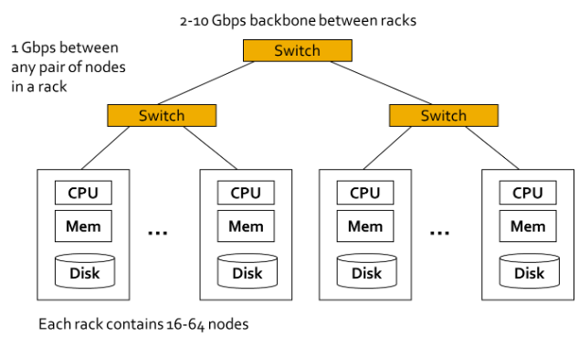

# 4 Replication, parititioning and transactions

## Distributed Data

* Reasons
    * Scalability: spread data volume
    * Fault tolerance / high availability: use multiple machines to give you redundancy
    * Latency: users around the world, servers at various locations worldwide

## Motivation: Google Example

* 20+ billion web pages x 20KB = 400+ TB
* 1 computer reads 30-35 MB/sec from traditional disk
    * 4 months to read the web
* ~1,000 hard drives to store the web
* Takes even more time to do something useful with the
data
* Today, a standard architecture for such problems has
emerged
    * Cluster of commodity (Linux) nodes
    * Commodity network (Ethernet) to connect them

## Cluster architecture

## Scaling to higher load

* Vertical scaling = buy a more powerful machine
    * Shared memory architecture: multiple CPUs all accessing any part of the memory or disk
        * Issues: cost, non-linear performance increases, performance ceiling, limited fault tolerance, single geographic location
    * Shared-disk architecture: several machines with independent CPUs, data is stored on a shared array of disks interconnected via fast network
        * Issues: contention, overhead of locking
* Horizontal scaling (a.k.a. shared-nothing
architectures): throw more resources at it
    * Each node has its CPUs, RAM and disks independently
    * Coordination between nodes is done at the software level, using a conventional network
    * No special hardware required
    * Currently mostly VMs / containers
    * Nodes can be distributed over geographic regions, reducing latency and potentially allowing to survive the loss of a data center

## Horizontal scaling challenges

* How can you distribute computational tasks
* Make it easy to wrtie distributed programs?
* How to handle failures?
    * One server may stay up 3 years
    * If you have 1000 servers, expect to loose 1/day

## Cloud computing

£ Computing as a utility
    * Utility services: water, electricity, gas
    * Consumers pay based on their usage
* Why now?
    * Experience with very large datacenters
        * Unprecedented economies of scale
        * Transfer of risk
    * Technology factors
        * Pervasive broadband internet
        * Maturity in virtualization technology
    * Business factors
        * Minimal capital expenditure
        * Pay-as-you-go billing model

## Replication vs partitioning

* Two common ways of distributing data across multiple nodes
    * Replication
        * Keeping a copy of the same data on several different nodes, potentially in different locations
        * Provides redundancy
        * Can help improve performance
    * Partitioning
        * Splitting a DB into smaller subsets called partitions so that different partitions can be assigned to different nodes
        * Helps improve performance

## Replication

### Definition

* Reasons to replicate data
    * Reduce latency: keep data geographically close to your users
    * Increase availability: allow the system to continue working even if parts have failed
    * Increase throughput: scale out the number of machines that can serve read queries
* Here: assume dataset can be replicated fully to each machine
* If data that needs replicating does not change over time replication is easy, just copy the data to every node
* Difficulty: handling replication with changing data

### Leaders and followers

* Each node that sores a copy of the DB is called a replica
* Multiple replicas: how do we ensure that all data ends up on all replicas?
    * Every write to the DB needs to be processed by every replica
    * Solution: leader-based replication (a.k.a. master-slave replication)
        * One of the replicas is designated as leader (a.k.a. master or primary)
        * Other replicas are followers (replicas, slaves, secondaries)
        * When a client wants to read from the DB, it can query either the lader or any of the followers

### Sync versus async replication

* Synchronous replication: leader waits until follower has confirmed it received the write
    * Before reporting success to the user
    * Before making the write visible to other clients
    * Follower is guaranteed to have an up-to-date copy of the data consistent with the leader
    * If the follower doesn’t respond, the write cannot be processed
* Asynchronous replication: leaders sends the message, but does not wait for response from follower
    * If leader fails and is unrecoverable, any writes that have not yet been replicated to followers are lost
    * Can continue processing writes, even if all of its followers have fallen behind
* In practice typically a mix: one follower will be synchronous, the others asynchronous
    * If the synchronous follower becomes unavailable or slow: promote an async follower to sync
    * A.k.a. semi-synchronous

### Setting up a new follower

1. Take a consistent snapshot of leader's DB at some point in time
    * Same feature as required for backups
    * If possible without taking a lock on the DB
2. Copy snapshot to new follower node
3. Follower connects to leader and requests all data changes that happened since snapshot was taken
    * Snapshot must be associated with an exact position in the leader's replication log
4. When follower has processed backlog of data changes since snapshot, it has caught up
    * Can now continue to process data changes from leader as they happen

### Handling node outages: follower