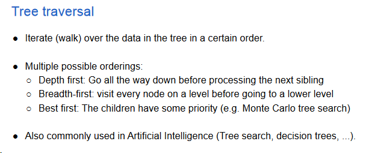
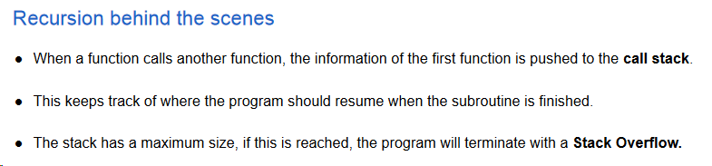
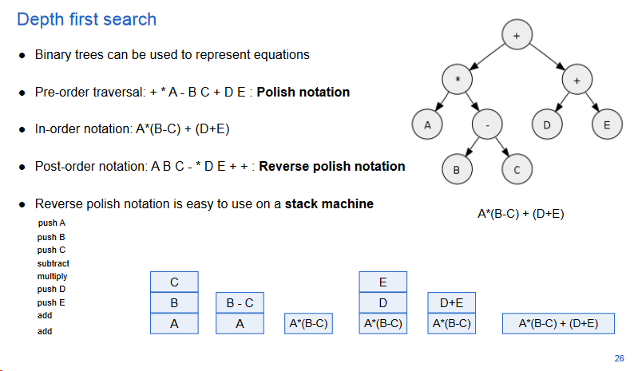
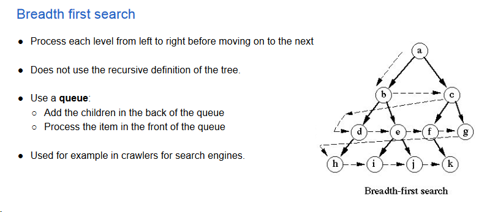
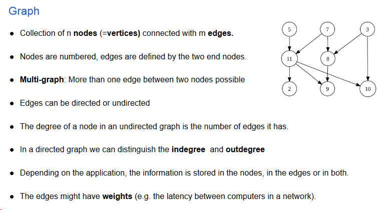

# Containers

* Geen gebruik van sleutels van de gegevens
* Of toegankelijk in een bepaalde volgorde, of opgeslagen op bepaalde plaatsen
* Sommige kunnen zowel als container en als woordenboek gebruikt worden

## Tabel

* Gegevens op te slaan zonder hun sleutels te gebruiken
* Volledige controle over de plaats waar ze terechtkomen
* Toegang niet onderhevig aan restricties
* Alle elementen even efficiënt bereikbaar
    * Rechtstreeks ondersteund door het inwendig geheugen van de computer
* Vaste grootte, niet even eenvoudig om op voorhand in te schatten
* Nieuwe grotere tabel reserveren, alle elementen uit de oude naar een nieuwe kopiëren, daarna vrijgeven
* Toevoegen aan een ongeordende tabel:
    * Normaal: O(1)
    * Tabel vol: slechter
* Performantie van een reeks opeenvolgende operaties bepalen, delen door het aantal operaties in de reeks
    * Geamortiseerde efficiëntie
    * Dynamische tabel: nog steeds O(1)
* Nieuwe tabel is dubbel zo groot als oude
    * Met vaste grootte uitbreiden, is slecht voor geamortiseerde performantie
    * De tijd voor de i-de toevoegoperatie is normaal gelijk aan één
        * Maar wordt gelijk aan i als het aantal elementen in de tabel een macht van twee is
        * Dan moeten we i - 1 elementen kopiëren, vooraleer het nieuw element kan toegevoegd worden

## Gelinkte lijst

* Elk element van een (gelinkte) lijst is toegankelijk
* Maar niet elk element is even efficiënt toegankelijk
* Knopen van de lijst bevatten een pointer die de volgende knop aanduidt
* Er is geen rechtstreeks toegangsmechanisme
* Elke knoop bevat een sleutel samen met (eventueel een wijzer naar) bijbehorende informatie
* Dubbel gelinkte lijst bewaart ook nog een pointer naar zijn voorloper
* Lijst afsluiten? Meestal nullpointer
* Voordeel van de lijst: 
    * Geen vaste grootte
    * Kan steeds uitgebreid worden
* Nadeel van de lijst:
    * Efficiënte toegang enkel aan de uiteinden
    * Knopen verspreid over het geheugen

## Stapel (Stack)

* Toevoegen (push)
* Verwijderen (pop) - steeds het laatst toegevoegde (LIFO)
* Testen of ledig
* Te verwijderen gegevens opvragen - opvragen zonder te verwijderen (top of peek)

* Toevoegvolgorde bijhouden -> lineaire gegevensstructuur
    * Tabel: achter elkaar opgeslagen in de volgorde waarin ze aankomen
        * Grootte niet wijzigt; aantal gegevens bijhouden
        * Stackpointer: bevat index van het laatst toegevoegde element
    * (Enkelvoudig) gelinkte lijst: geen probleem met volle stapel
    * Beide implementaties hebben O(1)

## Wachtrij (Queue)

* Toevoegen (enqueue)
* Verwijderen (dequeue) - steeds het langst aanwezige (FIFO)
* Testen of ledig

* Toevoegvolgorde bijhouden -> lineaire gegevensstructuur
    * Tabel
        * Bij queue: toevoegen aan de ene kant en verwijderen aan de tegenovergestelde kant
        * Gebruik van twee pointers ('head' en 'tail') om onafhankelijke operaties mogelijk te maken
        * Wachtrij met ringvormige tabel om grenzen te vermijden; wijzers bewegen constant in dezelfde richting
        * Initialisatie van de pointers bij een lege wachtrij.
        * Problemen met tabelindices en beperkte grootte worden aangepakt zoals hiervoor
    * (Enkelvoudig) gelinkte lijst
        * Bij queue: toevoegen achteraan en verwijderen vooraan
        * Geen problemen met tabelindices of beperkte grootte

## Deque

* Double-ended queue
* Combinatie van een Stack en Queue
* Opnieuw lineaire gegevensstructuur met beperkte toegang
* Operaties moeten aan de uiteinden van de structuur gebeuren, maar nu kan men aan beide kanten zowel toevoegen als verwijderen
* In- en output-restricted queue
    * Maar aan één kant toevoegen/verwijderen
* Implementaties vergelijkbaar met zijn twee "voorouders"
    * Alle operaties O(1)

## Tree

* Collection of nodes that store the data, connected with edges
* No loops
* Every node can be reached from every other node
* Collection of trees = forest
* Ordered tree: order of the children matters
* Multiway tree: children have fixed index, certain children might be missing

**Depth first search**

* Each subtree has a root and multiple subtrees

* Explore the search as far as possible from the root node

* Implement recursive or with a stack

**Recursion**

* Divide the problem in subproblems that are then again divided into
    subproblems

* Function that calls itself

* Example: linked list; tree ...

**Advantages**

Recursive solutions are elegant and easy to implement

**Disadvantages**

Typically slower than an implementation using loops; Uses more memory;
will not work for very large problems; difficult to debug

