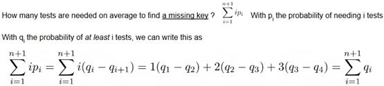
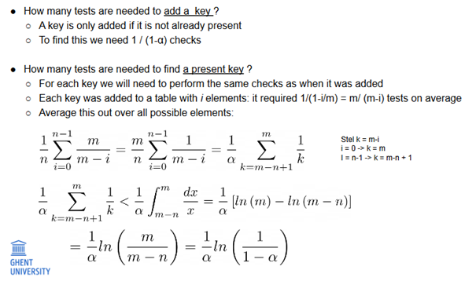
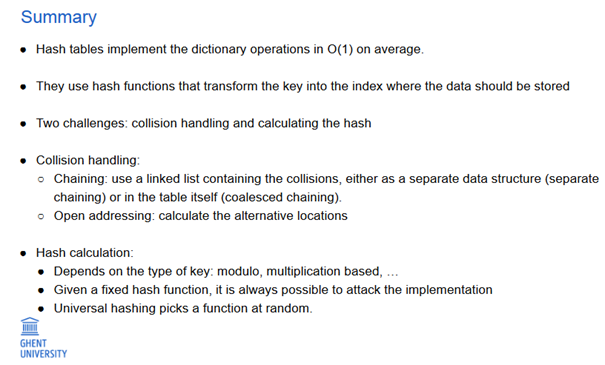

# Hash Tables

## Introduction

Hash tables use a hash function to translate a key to an index. They enable dictionary operations in O(1) time. The choice of the hash function is crucial, especially when dealing with a large number of possible keys, as collisions can occur.

## Handling Collisions

### Separate Chaining

- Store a linked list at every location.
- Retrieve:
  - Worst case: O(n)
  - Expected time: O(1) if load factor (α) is kept low; m=n
- Add: O(1)
- Remove: O(1)

### Coalesced Chaining

- New datapoint can be placed in any available slot with a pointer to that slot
- Retrieve: Calculate the hash and follow pointers if needed
- Add: Calculate the hash, use a free slot in case of collision
- Remove: Complicated, may involve lazy deletion
- Often outperforms other approaches

### Open Addressing

- Store everything in the hash table without pointing to the next slot
- Calculate the index in case of a collision
- Techniques for calculating the next location:
  - Linear probing
  - Quadratic probing
  - Double hashing

#### Performance

- Depends strongly on the load factor (α)
- Best to keep α low (around 0.5)
- Trade-off between memory and computation
- Rehashing is used to handle dynamic changes and is O(m), but O(1) amortized over all add operations

## Hash Functions

### Modulo Based Hash Function

- Key is mapped to an index by calculating the remainder after division by m: $h(s) = s \% m$
- Pick m carefully to avoid conflicts.

### Multiplication Based Hash Function

- h(s) = ⌊m(sC - ⌊sC⌋)⌋ (0 < C < 1)
- Less sensitive to the choice of m

### Universal Hashing

- Randomized algorithm
- $h_a$ $_,$ $_b$(s) = ((as +b) mod p ) mod m (0 < C < 1), where p is a prime number larger than k (number of possible keys)

## Handling Large Keys

- Treat the entire bit pattern string as a very large number.
- Calculate the hash of individual parts and combine them.
- Use different hash functions for each part and combine the results.
- Horner's method.

## HashMap in Java

- Default uses linked lists for collisions (Java 8 uses trees if collisions > 8).
- Implementation details: Initial size of 16, doubles when full.
- Optimized index calculation using bit shifts.

## HashCode in Java

- Classes should implement their own hashCode() method.
- Default implementation depends on Java version.
- Always override equals when overriding hashCode.
- Avoid using mutable objects as keys.

## String HashCode in Java

- Uses Horner's method.

## Cryptographic Hash Functions

- Different from hash functions in hash tables.
- Used in cryptography for message authentication and password validation.
- Examples: MD5, SHA, etc.

