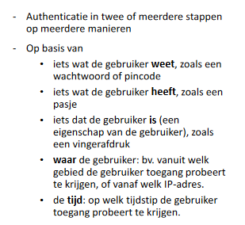

# Webapplicaties

## Authenticatie

- Afschermen delen van een website
- Twee stappen
  - Authenticatie
    - Gebruiker “herkennen”
    - De gebruiker is wie hij zegt te zijn
    - Inloggen
  - Autorisatie
    - Bepaalde rechten (niet) toekennen aan bepaalde gebruikers
      - Leden kunnen meer pagina’s bekijken dan niet-leden
      - Administrators kunnen nog andere pagina’s raadplegen

### Authenticatie met cookies (sessies)

- Client logt in via formulier
- Browser stuurt de logingegevens over een beveiligde verbinding (HTTPS) naar server
- Server voegt cookie toe met sessie-id in headers na controle login en wachtwoord
- Bij elke volgende aanvraag wordt de cookie in de headers meegestuurd
- Informatie over de client wordt bewaard in een object op de server (sessie-object)
- Voordelen:
  - Maar één keer inloggen
  - Geldigheid van de cookie kan uitgeschakeld worden
- Nadelen
  - Geldt maar voor één domein
  - Gevoelig voor XSS- en XSRF-aanvallen
  - (Tijdelijke) informatie van de gebruiker bewaard op de server (niet statusloos)

### Authenticatie met tokens

- Client logt in via formulier
- Browser stuurt de logingegevens over een beveiligde verbinding (HTTPS) naar server
- Server maakt token aan na controle login en wachtwoord
- Token wordt lokaal bewaard in de browser (local- of sessionStorage)
- Bij elke volgende aanvraag wordt de token meegestuurd in de Authorization-header
- Server decodeert token en voert vraag uit indien oké
- Voordelen:
  - Statusloos: elke token bevat voldoende informatie om gecontroleerd te worden (geen info op server)
  - Geen domein-problemen
  - Info van gebruiker zit in token
  - Niet gevoelig voor XSRF-aanvallen als de token bewaard wordt in de localStorage
- Nadelen:
  - Geldigheid van de token kan niet uitgeschakeld worden
  - Gevoelig voor XSS-aanvallen
**

## OAuth 2

### Tokens

- Random gegenereerde strings door Authorization Server
- Twee types
  - Access Token
    - Beperkte levensduur
    - Geeft toegang tot data op resource server
  - Refresh Token
    - Verstuurd naar Authorization Server om Access Token te vernieuwen

### Gebruik Token

- HTTP-parameter
- HTTP-header (Authorization)

### Registratie clientapplicatie

- Naam applicatie
- Redirect URI
- Grant Types: autorisatie types gebruikt door clientapplicatie
  - Authorization Code
  - Implicit 
  - Resource Owner Password Credentials
  - Client Credentials
- JavaScript Origin
  - Hostname: mag HTTP-requests sturen (CORS!)
- Antwoord autorisatie server
  - Client ID
  - Wachtwoord

### OAuth 2.0 Requests and Responses

- HTTPS
- Afhankelijk authorization grant type
  - Authorization Code Grant
  - Implicit Grant
  - Resource Owner Password Credentials Grant
  - Client Credentials Grant
- Client = webserver
  
- Client = JS-applicatie in browser
  
- Client en Autorisatie Server ontwikkeld door zelfde “authority”
  
- Client = Resource Owner
  

### Kwetsbaarheid

- Implicit
  - Minst veilige optie (access token beschikbaar in javascript in browser)
  - Oplossing: Autorisatieserver voorziet info over Token (controle client-id)
  - Afgeraden: beter Authorization Code + Proof Key for Code Exchange
- Clickjacking
  - Autorisatiepagina verbergen achter een transparent iframe
  - Gebruiker klikt op link over “Allow” knop
  - Oplossing: Autorisatieserver stuurt “X-Frame\_Options” header

## Single Sign On (SSO)

- Een keer inloggen voor verschillende webapps
- Maar één keer security implementeren
- Single point of failure
- Inbreuk op beveiliging veel apps en data getroffen
- Kan gerealiseerd worden met OAuth of SAML
**

## Two Factor Authentication

## Beveiligingsproblemen

# Verschillende types webapps

- Statische websites
- Dynamische websites
- Single Page Applications (SPA)
- Progressive Web Apps

