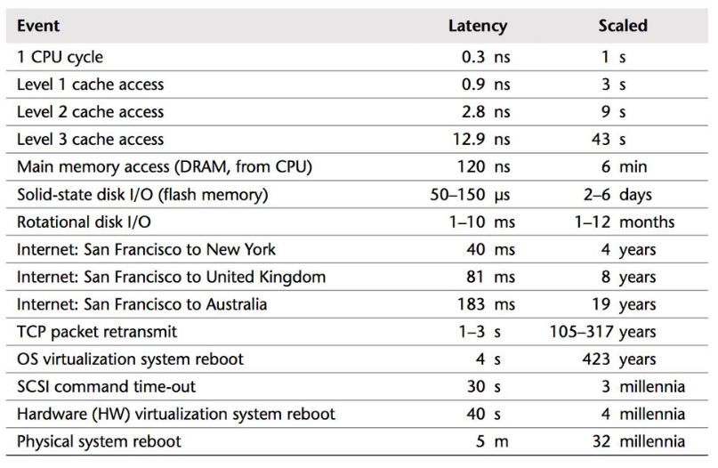

# External Data Structures

## General

* Use large external storage
    * If the amount of data is too large to fit in the main memory
* Very slow compared to main memory
* Read/write operations are the main bottleneck
* CPU instructions are negligible compared to IO operations
* Keep the number of IO operations as low as possible
* Copy large blocks to and from memory

* 2 families of approaches
    * Based on tree structures:
        * $B$-trees
        * $B^+$-trees
    * Based on hashing:
        * Extendible hashing
        * Linear hashing

## $B$-trees

* Extension of binary search tree
    * An external balanced search tree
* Very large *n*
    * To keep the depth of the tree low
        * Store a large number (50-10 000s) of keys in each node
* The keys are sorted
* The tree is too large to fit in memory
    * Nodes have to be copied from disk before they can be used
* Keep the tree balanced
    * All leaves are on the same level

* A B-tree of level *m* has the following properties:
    * Every internal node has:
        * at most *m* children
        * at least ⌈*m/2*⌉ children
    * Every internal node with *k+1* children contains *k* keys
    * The leaves have:
        * at least ⌈*m/2*⌉ - 1 keys
        * at most *m-1* keys
    * All leaves are on the same level
* The root has at least two children unless he is a leaf

### Internal nodes

* Pick *m* to be as high as possible to fill an entire page on disk
* Every node should have at least k = ⌈*m/2*⌉ children: ⌈*m/2*⌉ - 1 keys
* The *k* keys divide the range into *k+1* sub ranges
* Each subtree contains the elements from that subrange

### Properties

* Each node can store *m-1* keys
* Minimum number of keys in a tree of height *h*?
    * Calculate the minimal number of nodes
    * g = ⌈m/2⌉
    * $1 + 2\dfrac{(1-g^h)}{(1-g)}$

### Find operation

* Similar to searching in a binary search tree
    * Except we have to decide between more than two paths
* We keep the root node in memory
    * Other nodes have to be loaded into memory while we are descending
* For a given node
    * Search the key in the sorted list of keys
        * Linear search: O(m)
        * Binary search: O(lg m)
* Continue until found or end up at an empty slot
* We have to load all the nodes along the path in memory
    * $O(log_{⌈m/2⌉}n)$ disk operations
    * At each node: O(m) CPU operations

### Add operation

* Keys are added as a leaf
    * Adding an internal node would mean we have to add an entire subtree
* Search for the key and add it to the table of the leaf
* If the table of the leaf contains *m-1* elements
    * Split the table in two
    * Move half the keys to a new node on the same level
    * Insert an entry in the parent table
        * Potentially moving values to the right
* If the parent node is full
    * Split in two
    * Add an entry (middle key) to its parent table
* **B-trees grow at the top**
    * Keeps them balanced

#### Alternative

* If node full
    * Transfer key to sibling node
    * Avoids splitting the node
* Only possible if sibling has room to spare
* Requires rotation

#### Performance

* Splitting a node requires three disk operations (after reading node + parent)
* Worst case
    * Splitting all the nodes all the way up to the root
    * O(h) = $O(log_{⌈m/2⌉}n)$ disk operations
* O(m) CPU operations

### Remove operation

* Key stored in a:
    * Leaf:
        * Remove the key
        * If the number of keys in the leaf becomes too small
            * Merge back with a sibling
            * Move a key from the parent down
        * Revert the split operation
        * Alternative: transfer key from sibling (rotation)
    * Internal node:
        * We can't delete the key
            * We would delete an entire subtree by doing so
        * Replace key with its predecessor (a leaf)
* Alternative: lazy deletion

## $B^+$-trees

* Few disadvantages
    * Leaves allocate storage for child pointers
        * Even though they never have children
    * Deleting an internal node is complicated
    * Finding the successor and predecessor takes $O(log_{⌈m/2⌉}n)$ disk operations
    * More complex to implement
* Similar to B-trees but:
    * Internal nodes are only used as index
        * To guide the search
        * All data is stored in the leaves
    * Leaves form a linked list
        * Increasing key values (**sequence set**)
* Advantages
    * More keys can be stored in internal nodes
    * Leaves do not contain (null) pointers to child nodes anymore
    * We can easily find the successor of a key
    * We can easily iterate over all values
* $B^{(+)}$-trees are used in databases to store indexes

## External hashing

* B-trees support operations using the order of the keys in O(lg n) time
* Assigning a disk page to each element in our hash table
    * Advantages:
        * Easy to retrieve the page given a key
    * Disadvantages:
        * If there are lots of collisions, we might need to load multiple pages from disk
            * Chaining
            * Open addressing
        * Lots of storage wasted if a page is almost empty

## Binary Trie

* Use the bits of the hash value to descend a binary tree
* The leaves store references to disk pages

## Extendible hashing

* Instead of sorting the trie explicitly, we store it in a table
* Longest path (global depth: d) determines the number of elements in the table
* Not all paths are equally long, each page has a local depth: *k*

### Operations

#### Find

* Hash the key
* Find the corresponding page
* Find the key in the page
    * Linear search
    * Binary search
* Requires 1 disk operation

#### Add

* Find the page
* Add the key
* Page full?
    * split the page
    * According to the next bit of the hash of the keys
* If a page where k==d is full
    * Double the size of the table

#### Delete

* Find the page where the key is stored
* Delete the key
* Merge two pages if together they contain less than *m* keys
* Avoid repeated merging and splitting

## Linear hashing

* Alternative to extendible hashing
* Linear hashing != Linear probing
* Use the *d* last bits of the hash of a key as the address of the page on disk
* Logical address
    * Translated to a physical address by the operating system
* We split pages in sequential order when a page is full
* We do not necessarily split the pfull page but the next page in the sequence
* We keep track of which page to split next (p)
* We use an overflow page to deal with the additional keys

### Find operation

* Hash the key E.g. 10101110
* Should we look in page 10 (last two bits) or in page 110 (last three bits) ?
* Compare with p: “10” < “11” (binary) -> The page is already split, look in page 110

### Delete operation

* Inverse of the add operation
* Can undo the split operation
    * This merges two pages
* Avoid repeated splitting and merging

## Summary

* Data too big for internal memory
* Stored in slow external memory
* Transfer large pages
* B-trees
    * Extension of Binary Search trees
    * Balanced multi-way trees
    * Support dictionary operations + operations dealing with the order of the keys
    * Extension: B + -trees
* External hashing:
    * Extension of hash tables
    * Extendible hashing: use sequential bits of the hash to retrieve a page from external memory
    * Linear Hashing: use sequential bits of the hash as address of the pages in external memory